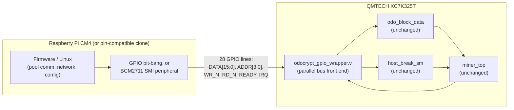

# AM01 + QMTECH Kintex-7 (XC7K325T) + Raspberry Pi CM4 variant

Status: **proposal / work in progress**, not a verified hardware revision.
This sketches a second alternate AM01 build, alongside `hardware/zynq/`,
using off-the-shelf boards instead of a custom PCB:

- [QMTECH XC7K325T dev/core board](https://www.aliexpress.com/) (Kintex-7,
  XC7K325T-1FFG676C) — ~$100, see its user manual for the full pin/schematic
  reference this doc is built from.
- A Raspberry Pi Compute Module 4 (or a pin-compatible clone, e.g. Orange Pi
  CM4), plugged into the QMTECH board's onboard CM4 socket.

Unlike `hardware/zynq/`, this isn't "ARM cores fused into the FPGA die" —
it's a **real ARM SoC on a separate, socketed module, wired to the FPGA
over 28 general-purpose GPIO lines** instead of on-chip AXI. Cheaper and
buildable from parts you can order today; slower/lower-level link than a
true Zynq PS↔PL fabric connection.

## Why this board

From the QMTECH user manual (`QMTECH XC7K325T DEV BOARD USER MANUAL V01`):

| Resource | XC7K325T-1FFG676C | vs. AM01's XC7A200T |
|---|---|---|
| Logic cells | 326,080 | 215,360 |
| Block RAM | 16,020 Kb (≈445 x 36Kb tiles) | ≈365 tiles |
| DSP48 slices | 840 | 740 |

Same "7-series" architecture family as the AM01's Artix-7 (same MMCME2 /
IOBUF / GTXE2 primitives), so `encrypt.v`, `keccak800.v`, `miner.v`,
`odo_block_data`, `host_break_sm` from `exmaples/odocrypt/fpga/src/hdl/`
port over unmodified — same conclusion as the Zynq doc. BRAM is the
binding resource for parallel hash-core instances (211 tiles/instance per
`exmaples/odocrypt/fpga/utilization.txt`), so this chip fits **~2
instances (~2x hashrate)** vs. today's single instance on the AM01.

Board specifics that matter for this design (from the manual):
- On-board 50MHz crystal, `SYS_CLK_F22` (ball **F22** by the schematic's
  own net-naming convention) — feeds an on-FPGA MMCM the same way AM01's
  external `gclk` oscillator does today.
- On-board S25FL128L SPI flash (16MB) for bitstream boot, M0:M1:M2 =
  1:0:0 (boot from SPI flash) — standard 7-series config, no surprises.
- On-board core power: MP8712 buck converter, up to 12A continuous on the
  1.0V core rail from a 2A@6V (12W) DC input — a real, documented power
  budget, not a bare-minimum dev-board trickle supply.
- **A Raspberry Pi CM4 socket** (two 100-pin connectors) wired directly to
  28 FPGA GPIOs (table below) — this is what replaces the Cypress FX3 /
  DQ-bus link the stock AM01 uses.

## Architecture

This is functionally the same "separate ARM SoC next to the FPGA"
architecture we considered as an alternative to the Zynq redesign, except
it's already-built hardware: no custom schematic, no PCB fab. The
trade-off is the link itself — general-purpose GPIO instead of on-chip
AXI, so `odocrypt_gpio_wrapper.v` implements its own small parallel-bus
protocol rather than being an AXI4-Lite slave.

## GPIO bus pinout (from the QMTECH manual's CM4 GPIO table)

28 lines are wired CM4↔FPGA; this design uses 24 of them, leaving 4 spare:

| Signal | GPIO(s) | XC7K325T pin(s) |
|---|---|---|
| `DATA[15:0]` | GPIO0–15 | C12,B11,C18,D18,E18,C11,D10,B12,A12,D14,C13,D13,A10,E10,C17,A15 |
| `ADDR[3:0]` | GPIO16–19 | B10,D16,B15,B9 |
| `WR_N` (active low) | GPIO20 | A9 |
| `RD_N` (active low) | GPIO21 | A8 |
| `READY` (FPGA→CM4) | GPIO22 | C14 |
| `IRQ` (FPGA→CM4, level) | GPIO23 | A14 |
| *reserved* | GPIO24–27 | B14,A13,C9,D15 |

See `xdc/qmtech_xc7k325t_pinout.xdc` for the actual constraints (LVCMOS33,
matching the manual's stated default 3.3V bank supply — **verify this
against the board's schematic for these specific balls before flashing**,
since the manual's bank-voltage section documents BANK12 explicitly but
not which bank each CM4 GPIO ball sits in).

## Protocol / register map

A simple 4-phase (fully interlocked) parallel bus, safe regardless of how
fast/slow the CM4 side drives it — whether that's bit-banged GPIO in
software or the BCM2711's SMI (Secondary Memory Interface) peripheral,
which the QMTECH manual explicitly calls out as an option for "faster
communication speed":

1. CM4 drives `ADDR` (+ `DATA` on a write), then asserts `WR_N` or `RD_N` low.
2. FPGA captures/produces the data, asserts `READY`.
3. CM4 sees `READY`, releases `WR_N`/`RD_N` high.
4. FPGA sees the strobe released, drops `READY`. Bus is idle again.

Registers are 16 bits/beat (matching the 16-wide `DATA` bus); the 32-bit
header/target words and golden nonce take two beats (LO then HI), same
idea as the Zynq wrapper's register map but split to fit this bus width:

| `ADDR` | Name | Access | Meaning |
|---|---|---|---|
| 0 | `VERSION` | RO | Build/version tag |
| 1 | `CTRL` | WO (pulse bits) | bit0 `SOFT_RST`, bit1 `HOST_BREAK` |
| 2 | `STATUS` | RO | bit0 `HASH_ACTIVE`, bit1 `NONCE_VALID` |
| 3 | `NONCE_LO` | RO | Golden nonce, low 16 bits |
| 4 | `NONCE_HI` | RO | Golden nonce, high 16 bits; **reading this clears `NONCE_VALID`/`IRQ`** |
| 5 | `HEADER_LO` | WO | Next header word, low 16 bits (staged) |
| 6 | `HEADER_HI` | WO | High 16 bits; **writing this commits the 32-bit word** into `odo_block_data`'s header shift chain (write 19 times total) |
| 7 | `TARGET_LO` | WO | Next target word, low 16 bits (staged) |
| 8 | `TARGET_HI` | WO | High 16 bits; **commits** the word (write 8 times total; the 8th arms `start_hash`) |
| 9–15 | *reserved* | — | — |

Firmware flow is the same shape as the Zynq variant: write 19 header
words (LO then HI each) → write 8 target words (LO then HI each) → poll
`STATUS` or wait on `IRQ` → read `NONCE_LO` then `NONCE_HI`.

`odocrypt_gpio_wrapper.v` bridges this bus (run off the board's onboard
50MHz system clock, or an MMCM-derived faster clock) into the hash-core
clock domain via the same toggle/ack synchronizer pattern used in
`hardware/zynq/hdl/odocrypt_axi_wrapper.v` — one write commit or read
completes at a time, so the request/data lines are guaranteed stable
across the clock-domain crossing without needing a heavier CDC FIFO.

## What's still needed before this is real hardware

Same category of gaps as the Zynq proposal:

1. **CM4-side software** to drive the bus — either bit-banged GPIO
   (simplest, slowest, fine for this workload's tiny data volume) or the
   BCM2711 SMI peripheral (faster, more setup: device-tree overlay +
   `/dev/smi` or a small kernel driver). Not included here.
2. **CDC and timing signoff** — the synchronizers on `WR_N`/`RD_N`/`ADDR`/
   `DATA` need `ASYNC_REG` constraints and proper timing exceptions, same
   caveat as the Zynq wrapper.
3. **Verify the GPIO bank/voltage** for the 28 CM4-linked balls against
   the QMTECH schematic before flashing — this doc assumes the manual's
   stated global 3.3V default, but that should be confirmed pin-by-pin.
4. **New Vivado project** targeting XC7K325T-1FFG676C: regenerate a
   clocking wizard IP off the 50MHz `SYS_CLK_F22` crystal (replacing
   `artix200_v3_clocking`), and skip the DDR3/MIG IP entirely — nothing
   in this design needs external DRAM.
5. **Physical assembly**: seat the CM4 module, confirm `JP6` jumper state
   per the manual (open when a CM4 is installed, since pins 86/88 are
   power outputs from the module), and power the board from a 6V/2A+
   supply.
