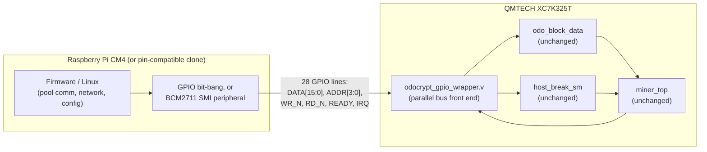

# AM01 + QMTECH Kintex-7 (XC7K325T) + Raspberry Pi CM4 variant

Status: **proposal / work in progress**, not a verified hardware revision.
This sketches a second alternate AM01 build, alongside `hardware/zynq/`,
using off-the-shelf boards instead of a custom PCB:

- [QMTECH XC7K325T dev/core board](https://www.aliexpress.com/) (Kintex-7,
  XC7K325T-1FFG676C) — ~$100, see its user manual for the full pin/schematic
  reference this doc is built from.
- A Raspberry Pi Compute Module 4 (or a pin-compatible clone, e.g. Orange Pi
  CM4), plugged into the QMTECH board's onboard CM4 socket.

Unlike `hardware/zynq/`, this isn't "ARM cores fused into the FPGA die" —
it's a **real ARM SoC on a separate, socketed module, wired to the FPGA
over 28 general-purpose GPIO lines** instead of on-chip AXI. Cheaper and
buildable from parts you can order today; slower/lower-level link than a
true Zynq PS↔PL fabric connection.

## Related prior art

[colneech-dev/odo-miner-cyclonev](https://github.com/colneech-dev/odo-miner-cyclonev)
is a **deployed, hardware-verified** instance of this exact pattern — a
QMTECH board (Cyclone V SoC, so Intel/Altera HPS+FPGA instead of a
CM4+Kintex-7 pair) autonomously mining OdoCrypt with the pool client
running on the on-board ARM cores. It's mined 485+ blocks on mainnet.
Several numbers and lessons below (clock target, the register-map-drift
warning, the nonce-delivery CDC gap) are pulled directly from that
project's docs, since it's real-world validation this repo doesn't have
yet. Its `docs/register-map.md` and `docs/uio-miner-io-scope.md` are
worth reading in full if you're implementing the pieces this repo only
sketches.

## Why this board

From the QMTECH user manual (`QMTECH XC7K325T DEV BOARD USER MANUAL V01`):

| Resource | XC7K325T-1FFG676C | vs. AM01's XC7A200T |
|---|---|---|
| Logic cells | 326,080 | 215,360 |
| Block RAM | 16,020 Kb (≈445 x 36Kb tiles) | ≈365 tiles |
| DSP48 slices | 840 | 740 |

Same "7-series" architecture family as the AM01's Artix-7 (same MMCME2 /
IOBUF / GTXE2 primitives), so `encrypt.v`, `keccak800.v`, `miner.v`,
`odo_block_data`, `host_break_sm` from `hdl/odocrypt/` (a copy of
`exmaples/odocrypt/fpga/src/hdl/` kept in sync with the current OdoCrypt
epoch — see `hdl/odocrypt/NOTICE`) port over unmodified — same conclusion
as the Zynq doc. BRAM is the
binding resource for parallel hash-core instances (211 tiles/instance per
`exmaples/odocrypt/fpga/utilization.txt`), so this chip fits **~2
instances (~2x hashrate)** vs. today's single instance on the AM01.

## Expected hashrate — derived from this part, not extrapolated

**Total hashrate is BRAM-bound, and works out to `≈ 0.5 x Fmax` once the
chip's block RAM is fully used.** Everything else follows from that.

Where the BRAM goes (measured, `yosys synth_xilinx` targeting this chip,
not estimated): all 420 RAMB18 of one hash instance are OdoCrypt's large
S-boxes — `encrypt_4sbox_large0..9`, one BRAM each, x42 encrypt blocks.
Logic is far less pressed: **39,915 LUT = 19.6% of 203,800** per
instance (yosys's "30,022 LC" estimate understates it; the real LUT count
is what matters), and **zero** of the 840 DSP48s. This design is
BRAM-starved and logic-rich — see "Can the idle logic buy a 3rd
instance?" below for why that headroom still cannot be spent on more
cores.

The block RAM is all in `encrypt.v`, and it scales with **encrypt's**
unrolling: `encrypt_4apply_sboxes` instantiates 20 `sbox_large` per
round, one RAMB18 each, across `U = (84-1)/THROUGHPUT + 1` unrolled
rounds — **20 RAMB18 per unrolled encrypt round**, 20 x 21 = 420 at
THROUGHPUT 4. (`keccak800.v` has no memories at all; it is pure XOR/AND
logic. An earlier revision of this table derived the 420 from keccak's
`UNROLLING` and quoted "140 RAMB18 per unrolled round". That happens to
give the right per-row totals at THROUGHPUT 4, 6 and 12 — encrypt's
unrolling is exactly 7x keccak's at those three points — but it is wrong
elsewhere, e.g. THROUGHPUT 7 gives 240 RAMB18, not the 280 that model
predicts.) The XC7K325T has **890 RAMB18** (445 x RAMB36):

| THROUGHPUT | encrypt `U` | BRAM/inst | Instances that fit | Total rate |
|---|---|---|---|---|
| 4 (what `encrypt.v` hardcodes) | 21 | 420 | 2 | 0.50 x Fmax |
| 6 | 14 | 280 | 3 | 0.50 x Fmax |
| 7 | 12 | 240 | 3 | 0.43 x Fmax |
| 12 | 7 | 140 | 6 | 0.50 x Fmax |
| 21 | 4 | 80 | 11 | 0.52 x Fmax |

Note how flat that last column is. **Tuning THROUGHPUT alone buys
nothing** — the BRAM budget fixes the ceiling, and no value of THROUGHPUT
moves it by more than ~5%.

That makes THROUGHPUT a *free variable* rather than a dead end: it can be
changed to buy something other than rate. See
[HASHRATE-REVIEW.md](HASHRATE-REVIEW.md) §2.3 — the +1-stage shared-BRAM
variant that `tools/mux2_pipelined_transform.py` records as
unschedulable is unschedulable **only at THROUGHPUT 4**; it is available
at 5, 7, 9, 11, 13 at identical rate.

(An earlier revision of this section also argued the clock is "limited by
combinational depth, which UNROLLING sets", and that THROUGHPUT=4 runs
"the deepest logic path (3 keccak rounds between registers)". That is not
this design's structure: every `keccak_round` contains a `keccak_buffer`
register between theta and rho, and every encrypt round registers at
`apply_sboxes`, so each round is two pipeline stages and the logic depth
between registers is **constant regardless of UNROLLING**. Unrolling
changes instance count, and therefore congestion — not path depth.)

**What this part is actually rated for** (Kintex-7 datasheet ds182,
**-1** speed grade — the grade on this board's XC7K325T-1FFG676C):

| | -1 grade limit |
|---|---|
| Block RAM `FMAX_BRAM` | **458 MHz** |
| DSP48E1 `FMAX` (all registers) | 548 MHz |

So BRAM is nowhere near the limiter; the fabric path is.

**MEASURED (nextpnr STA, post-placement, single instance):**

```
Max frequency for clock 'bus_clk': 246.00 MHz  (PASS at 150 MHz)
Max frequency for clock   'clk_h': 135.04 MHz  (FAIL at 150 MHz)
```

`clk_h` is the hash clock. At `THROUGHPUT=4` that is `135.04 / 4` =
**33.8 MH/s per instance**:

| Scenario | Fmax | Hashrate |
|---|---|---|
| 1 instance @ measured 135 MHz (half the BRAM idle) | 135 | 33.8 MH/s |
| **2 instances @ measured 135 MHz (BRAM filled)** | **135** | **~67.5 MH/s** |
| 2 instances if Vivado closes at 200 MHz | 200 | 100 MH/s |
| Hard BRAM ceiling (bounds the problem; not reachable) | 458 | 229 MH/s |

**Best current estimate for this board: ~42 MH/s.**

The ~67.5 MH/s figure above is superseded and was optimistic by about
1.6x. It rests on 135.04 MHz, which came from a static timing analysis
that does not time block-RAM paths at all — in a design that is 420 block
RAMs per hash instance. With block RAM timing added to nextpnr (see
[openxc7/](openxc7/)), the same single hash instance measures:

| nextpnr | `clk_h`, one instance, post-placement |
|---|---|
| stock (block RAM paths untimed) | 146.20 MHz |
| **with block RAM timing** | **84.90 MHz** |

Timing the memory paths costs 42% of the clock. At `THROUGHPUT=4` that is
21.2 MH/s per instance, so **~42.5 MH/s for the 2-instance build**.

Caveats, all pointing the same way — down:

- Post-placement, like the 135.04 MHz it replaces. Routing normally
  degrades timing further.
- The block RAM numbers are Artix-7-derived (prjxray has none for
  Kintex-7), so they are pessimistic — but the *direction* of the
  correction is not in doubt, only its size.
- Neither run routed to completion in the measurement harness.

### The earlier projection here was too optimistic — by about 2x

A previous revision of this section projected 150-300 MHz and
"~120-150 MH/s", reasoning that a Kintex-7 -1 would clock roughly 1.5x a
Cyclone V. **Measurement does not support that.** odo-miner-cyclonev
measured Fmax 162 MHz on this same core; this Kintex-7 -1 measures
135 MHz. For this design, on this flow, **the Kintex-7 clocks lower than
the Cyclone V did.**

That is less contradictory than it looks. The Kintex-7 is genuinely the
bigger part — more BRAM, ~50% more logic cells, block RAM rated to
458 MHz — but capacity and frequency are different axes. None of that
extra capacity shortens the critical path, which runs through a BRAM
S-box lookup plus three unrolled keccak rounds (`UNROLLING=3` at
`THROUGHPUT=4`). The capacity is what the 2-instance build spends, and
that is a real 2x; it just does not buy any clock.

(That description of the critical path is the design's actual structure,
but note it is *not* what nextpnr measured — see the third qualification
below. A path out of a BRAM S-box is exactly the kind this flow's STA
does not time.)

Three qualifications on the 135 MHz. The third undercuts the other two.

- **It is nextpnr's STA, not Vivado's.** Open-source PnR generally has
  worse QoR than vendor tools, so Vivado on the same silicon could
  plausibly close higher. (The 200 MHz row above is illustrative of that,
  not a measurement.)
- **It is post-placement.** Routing normally degrades timing, so the
  final routed figure is likely at or below 135 MHz.
- **nextpnr does not appear to time paths starting at a block RAM output
  on this chipdb.** Inserting a register into a BRAM-fed path — which can
  only shorten each path — made the reported Fmax *fall* from 840 MHz to
  197 MHz in a controlled harness. A working timing model cannot do that;
  the BRAM-to-fabric path was simply never considered. Full measurements
  in [openxc7/README.md](openxc7/README.md#nextpnrs-sta-does-not-see-block-ram-paths).

That third point matters here more than anywhere, because this design is
420 block RAMs per hash instance and the paragraph above asserts its
critical path "runs through a BRAM S-box lookup plus three unrolled
keccak rounds". If BRAM paths are not timed, that path is not what
produced 135.04 MHz — a fabric-only path did. So **135 MHz is an upper
bound on this flow's Fmax, not a floor, and ~67.5 MH/s is optimistic
rather than conservative.** Treat every hashrate figure on this page as
provisional until a tool that times BRAM arcs (Vivado STA) confirms the
clock.

### Why the Cyclone-V anchor was still the wrong method

An earlier revision of this doc derived the number from
[odo-miner-cyclonev](https://github.com/colneech-dev/odo-miner-cyclonev),
which runs this same core on real hardware at 156.25MHz / THROUGHPUT 6 =
26.0 MH/s (the arithmetic is exactly `clock / THROUGHPUT`, which is how
that project's measured rate confirms the model). That gave "37.5 MH/s
per instance, ~75 MH/s for two".

Cyclone V is Intel's *low-cost* family and Kintex-7 is Xilinx's
*mid-range performance* family (its peer is Arria V), so reasoning
"bigger family, therefore faster clock" felt safe. **It wasn't.** The
method was wrong even though, by luck, the Cyclone-V-derived number
(75 MH/s for two instances) landed much closer to the measured ~67.5
MH/s than the "corrected" 120-150 MH/s did.

The lesson worth keeping: family class predicts *capacity*, not the
critical path of a specific pipeline. Only STA on the actual design
settles frequency — which is what the numbers above now are.

### Can the idle logic buy a 3rd instance? No — measured

The chip looks underused: 2 instances take **840/890 BRAM (94%)** but only
**79,830/203,800 LUT (39%)**, and **0 of 840 DSP48s**. The obvious idea is
to spend that idle logic on more hash cores by building S-boxes out of
LUTs instead of BRAM. It does not work, and the margin is not close.

Budget after 2 instances: **123,970 LUT and 50 BRAM free**. A 3rd
instance needs its 39,915 base LUTs plus LUT-built S-boxes for 370 of its
420 (the leftover 50 BRAMs cover the rest), so it fits only if

```
39,915 + 370 x cost <= 123,970   ->   cost <= 227 LUT per S-box
```

Measured, by synthesising one `encrypt_4sbox_large0` with
`synth_xilinx -nobram`:

```
LUT6 352   LUT1-5 54   -> LUT total 406
MUXF7 190  MUXF8   70
```

**406 LUT per S-box, against a 227 threshold — 1.8x over.** A 3rd
instance would need `39,915 + 370 x 406 = 190,135 LUT` versus 123,970
available: over by 66,165 (1.5x).

This is a hard limit, not a tooling artifact. A `1024x10` ROM holds
10,240 bits; a LUT6 holds 64. That is a floor of **160 LUT6 per read
port, 320 for the two ports** this S-box has, before any address-mux
overhead — and the measured 406 sits just above that floor, so yosys is
not being wasteful. One RAMB18 stores 18,432 bits and serves both ports,
making BRAM roughly **40x denser** for this job. That density is the
entire reason the S-boxes are in block RAM.

Two related non-starters, for completeness:

- **"Add more read ports."** A Xilinx block RAM is hard silicon with
  exactly two ports. `sbox_large` already uses both (`a_in`/`b_in`).
  Three instances would need 1,260 RAMB18 against 890 regardless.
- **Packing two S-boxes per BRAM.** Each needs both ports, so two would
  need four. Capacity would allow it (2 x 10,240 < 18,432 bits); ports
  do not.

So **2 instances is the ceiling**, and the only remaining use for the
idle 61% of LUTs is raising Fmax (retiming, register replication to cut
fanout on the paths that pin `clk_h` at 135 MHz while the bulk of the
design has slack for ~270 MHz).

### Caveats — read before quoting any of these numbers

1. **The Fmax above is nextpnr's STA, not Vivado's, and is
   post-placement.** Place-and-route now completes (it did not before —
   the blocker was a fixed upstream bug, see `openxc7/README.md` §2), so
   this is a real measurement rather than an extrapolation. But
   open-source PnR generally has worse QoR than vendor tools, and
   routing typically degrades timing further. Floor, not ceiling.
2. **Nothing here has run on real silicon.** No bitstream has been
   flashed to the board.
3. **THROUGHPUT is not a knob you can just turn.** `encrypt.v` is a
   ~15,000-line *generated* file with `THROUGHPUT = 4` baked in, and it
   is regenerated per OdoCrypt epoch (the algorithm mutates every 10
   days). Changing it means re-running the upstream generator.

Board specifics that matter for this design (from the manual):
- On-board 50MHz crystal, `SYS_CLK_F22` (ball **F22** by the schematic's
  own net-naming convention) — feeds an on-FPGA MMCM the same way AM01's
  external `gclk` oscillator does today.
- On-board S25FL128L SPI flash (16MB) for bitstream boot, M0:M1:M2 =
  1:0:0 (boot from SPI flash) — standard 7-series config, no surprises.
- On-board core power: MP8712 buck converter, up to 12A continuous on the
  1.0V core rail from a 2A@6V (12W) DC input — a real, documented power
  budget, not a bare-minimum dev-board trickle supply.
- **A Raspberry Pi CM4 socket** (two 100-pin connectors) wired directly to
  28 FPGA GPIOs (table below) — this is what replaces the Cypress FX3 /
  DQ-bus link the stock AM01 uses.

## Architecture



This is functionally the same "separate ARM SoC next to the FPGA"
architecture we considered as an alternative to the Zynq redesign, except
it's already-built hardware: no custom schematic, no PCB fab. The
trade-off is the link itself — general-purpose GPIO instead of on-chip
AXI, so `odocrypt_gpio_wrapper.v` implements its own small parallel-bus
protocol rather than being an AXI4-Lite slave.

## GPIO bus pinout (from the QMTECH manual's CM4 GPIO table)

28 lines are wired CM4↔FPGA; this design uses 24 of them, leaving 4 spare:

| Signal | GPIO(s) | XC7K325T pin(s) |
|---|---|---|
| `DATA[15:0]` | GPIO0–15 | C12,B11,C18,D18,E18,C11,D10,B12,A12,D14,C13,D13,A10,E10,C17,A15 |
| `ADDR[3:0]` | GPIO16–19 | B10,D16,B15,B9 |
| `WR_N` (active low) | GPIO20 | A9 |
| `RD_N` (active low) | GPIO21 | A8 |
| `READY` (FPGA→CM4) | GPIO22 | C14 |
| `IRQ` (FPGA→CM4, level) | GPIO23 | A14 |
| *reserved* | GPIO24–27 | B14,A13,C9,D15 |

See `xdc/qmtech_xc7k325t_pinout.xdc` for the actual constraints (LVCMOS33,
matching the manual's stated default 3.3V bank supply — **verify this
against the board's schematic for these specific balls before flashing**,
since the manual's bank-voltage section documents BANK12 explicitly but
not which bank each CM4 GPIO ball sits in).

## Protocol / register map

> **Single source of truth.** Any change to the table below MUST be
> matched in `hdl/odocrypt_gpio_wrapper.v` and `cm4-firmware/am01_gpio_bus.c`
> in the same commit. This isn't a formality: odo-miner-cyclonev's own
> register-map doc calls register-map/wrapper drift **"the #1 bring-up
> failure mode"** for this exact kind of project, and their firmware and
> RTL don't have automated drift protection — that's on the "still needed"
> list below, not something to assume is covered.

A simple 4-phase (fully interlocked) parallel bus, safe regardless of how
fast/slow the CM4 side drives it — whether that's bit-banged GPIO in
software or the BCM2711's SMI (Secondary Memory Interface) peripheral,
which the QMTECH manual explicitly calls out as an option for "faster
communication speed":

1. CM4 drives `ADDR` (+ `DATA` on a write), then asserts `WR_N` or `RD_N` low.
2. FPGA captures/produces the data, asserts `READY`.
3. CM4 sees `READY`, releases `WR_N`/`RD_N` high.
4. FPGA sees the strobe released, drops `READY`. Bus is idle again.

Registers are 16 bits/beat (matching the 16-wide `DATA` bus); the 32-bit
header/target words and golden nonce take two beats (LO then HI), same
idea as the Zynq wrapper's register map but split to fit this bus width:

| `ADDR` | Name | Access | Meaning |
|---|---|---|---|
| 0 | `VERSION` | RO | Build/version tag |
| 1 | `CTRL` | WO (pulse bits) | bit0 `SOFT_RST`, bit1 `HOST_BREAK` |
| 2 | `STATUS` | RO | bit0 `HASH_ACTIVE`, bit1 `NONCE_VALID` |
| 3 | `NONCE_LO` | RO | Golden nonce, low 16 bits |
| 4 | `NONCE_HI` | RO | Golden nonce, high 16 bits; **reading this clears `NONCE_VALID`/`IRQ`** |
| 5 | `HEADER_LO` | WO | Next header word, low 16 bits (staged) |
| 6 | `HEADER_HI` | WO | High 16 bits; **writing this commits the 32-bit word** into `odo_block_data`'s header shift chain (write 19 times total) |
| 7 | `TARGET_LO` | WO | Next target word, low 16 bits (staged) |
| 8 | `TARGET_HI` | WO | High 16 bits; **commits** the word (write 8 times total; the 8th arms `start_hash`) |
| 9–15 | *reserved* | — | — |

Firmware flow is the same shape as the Zynq variant: write 19 header
words (LO then HI each) → write 8 target words (LO then HI each) → poll
`STATUS` or wait on `IRQ` → read `NONCE_LO` then `NONCE_HI`.

`odocrypt_gpio_wrapper.v` bridges this bus (run off the board's onboard
50MHz system clock, or an MMCM-derived faster clock) into the hash-core
clock domain via the same toggle/ack synchronizer pattern used in
`hardware/zynq/hdl/odocrypt_axi_wrapper.v` — one write commit or read
completes at a time, so the request/data lines are guaranteed stable
across the clock-domain crossing without needing a heavier CDC FIFO.

## Repo layout

- `xdc/qmtech_xc7k325t_pinout.xdc` — pin constraints (bus, clock, LEDs, keys).
- `hdl/odocrypt_gpio_wrapper.v` — the parallel-bus front end + CDC bridge.
- `hdl/clk_gen_hash.v` — hash-core clock (MMCME2_BASE off the 50MHz crystal).
- `hdl/am01_qmtech_top.v` — top level wiring the above together, plus
  bring-up status LEDs (MMCM-locked, clk_h heartbeat).
- `vivado/build.tcl` — non-interactive Vivado project generator
  (`vivado -mode batch -source build.tcl`); no IP Integrator needed.
- `cm4-firmware/` — bit-banged GPIO driver (libgpiod) for the CM4 side:
  `am01_gpio_bus.[ch]` (the library) + `am01_bus_test.c` (bring-up CLI) +
  `Makefile`. See its own README for build/run instructions.
- `case/` — a parametric OpenSCAD 3D-printable case for the QMTECH board
  itself: a fully enclosed two-part box (tray + lid) in three variants
  (sealed / vented / tall-XL), sized around a real BGA heatsink, with
  connector cutouts on the three walls the board's I/O actually uses.
  See its own README for the design assumptions and print notes.
- `openxc7/` — **Vivado-free build flow, verified to produce a real
  `.bit` for this board's exact chip.** Scripts to generate the
  Kintex-7 chipdb (which no toolchain ships prebuilt) and run
  yosys → nextpnr-xilinx → fasm2frames → xc7frames2bit, plus a smoke-test
  design. See its README — there are two gotchas that will otherwise cost
  you a day.

## What's still needed before this is real hardware

Design/RTL and a first-cut CM4 driver exist now (above); what's left is
verification against real parts, not more design work:

1. ~~CM4-side software~~ — done as a first cut: `cm4-firmware/` implements
   the bit-banged path. The BCM2711 SMI peripheral (faster, more setup:
   device-tree overlay + `/dev/smi` or a small kernel driver) is still a
   TODO, worth doing only if the bit-banged path turns out too slow.
2. **CDC and timing signoff** — the synchronizers on `WR_N`/`RD_N`/`ADDR`/
   `DATA` need `ASYNC_REG` constraints and proper timing exceptions, same
   caveat as the Zynq wrapper. `clk_gen_hash.v`'s `CLKOUT0_DIVIDE` now
   targets 150MHz (cross-referenced from odo-miner-cyclonev's Quartus
   build of the same `miner.v` core, see above) rather than an arbitrary
   guess, but it's still not a Vivado STA result for this exact wrapper —
   re-verify and retune once you can synthesize it.
3. ~~Verify the GPIO bank/voltage for the 28 CM4-linked balls~~ — **done**,
   against the vendor's own schematic and prjxray-db's package data rather
   than the manual. Results (details in `xdc/qmtech_xc7k325t_pinout.xdc`'s
   header):
   - All 30 `PACKAGE_PIN`s in the .xdc are **real balls** on ffg676,
     checked against `package_pins.csv` for `xc7k325tffg676-1`.
   - Bank rails, from schematic sheet 4's `U11Q` VCCO block: banks
     **0/13/14/15/16 → 3V3**, bank **12 → VCCO_12** (itself tied to 3V3
     through the 0R links R31/R32), banks **32/33 → 1V8**, bank
     **34 → 1V5**. The 1V8/1V5 banks are the DDR3 interface, which this
     variant doesn't use.
   - Every signal this .xdc constrains lands in banks 12–16, i.e. all on
     3.3V rails, so **`LVCMOS33` throughout is correct**.
   - **A previous revision of this repo got this wrong**: it set
     `SW2`/`SW3` to `LVCMOS18`, claiming their pull-ups went to 1.8V.
     They actually go to `VCCO_12`, which is 3V3 — and both balls (U26,
     V26) are in bank 12, whose VCCO *is* that same rail. Wrong on two
     independent counts; corrected to `LVCMOS33`. (Declaring a 1.8V
     standard on a 3.3V-powered bank is a Vivado DRC error, and a
     reliability problem if forced through.)
4. ~~New Vivado project~~ — done: `vivado/build.tcl` scaffolds it from the
   command line (no IP Integrator block design; clocking is hand-written
   MMCME2_BASE in `hdl/clk_gen_hash.v`). Not run against real Vivado as
   part of this repo (no license/install in this environment), so treat
   it as unverified until someone runs it.

   **This matters more than it looks, because there is no free Vivado for
   this chip.** Vivado ML Standard (the free tier, ex-WebPACK) covers
   Artix-7, Spartan-7, some Zynq-7000 and only the *smaller* Kintex-7
   parts — the XC7K325T needs a paid licence (~$4,395 node-locked at last
   check; AMD moved to new tiered pricing in 2026.1). The stock AM01's
   XC7A200T is free to build; this board's chip is not.

   ~~openXC7 is worth a look~~ — **evaluated, and it works**: a fully
   open-source flow now takes Verilog to a valid `.bit` for
   `xc7k325tffg676-1`. See **[`openxc7/`](openxc7/)** for the scripts and
   the two non-obvious gotchas (no prebuilt Kintex-7 chipdb exists — you
   generate it; and a from-source `nextpnr-xilinx` 0.9.2 build fails to
   route, so use apio's prebuilt binary). The `.xdc`/RTL here were
   written for Vivado's constraint syntax and 7-series primitives
   (`MMCME2_BASE`, `IBUF`, `BUFG`); the .xdc subset used by the smoke
   test parsed fine under nextpnr, but **the real `am01_qmtech_top` has
   not yet been through the openXC7 flow** — only a trivial counter has.
5. **Physical assembly**: seat the CM4 module, confirm `JP6` jumper state
   per the manual (open when a CM4 is installed, since pins 86/88 are
   power outputs from the module), and power the board from a 6V/2A+
   supply.
6. **A real pool/stratum client** on the CM4 side to feed
   `am01_bus_submit_work()` real work instead of `am01_bus_test.c`'s
   all-zero dummy — not attempted here, see `cm4-firmware/README.md`.
7. **Nonce delivery is a single-register latch, not a FIFO.** Two
   distinct problems lived here; one is now fixed, one is not.

   *Changed (reference fidelity, not a proven bug fix):* the wrapper
   consumed `miner_top`'s `ticket2moon` **raw**, in two places, despite
   comments claiming it mirrored `atomminer_odocrypt.v`. That signal is
   the bare combinational "hash meets target" comparator (`miner.v`:
   `assign ticket2moon = res`), and the reference never uses it raw — it
   feeds `ticket2moon & nonce_out_go_top` to both consumers. The wrapper
   now does the same, plus a one-shot edge detect for its toggle-based
   CDC (which the reference doesn't need, shipping results over FX3).

   **Be clear about the evidence.** Two hazards were hypothesised for the
   raw signal — a spurious assertion during pipeline warm-up (which also
   reaches `host_break_sm`, and so could stall hashing), and a
   multi-cycle level tearing the nonce mid-CDC. **Neither reproduced in
   simulation.** With `target` all-ones from reset, iverilog measured
   `ticket2moon` as a definite `0` for all 206 warm-up cycles (0 cycles
   at `1`, 0 at `X`), then exactly one 1-cycle assertion per
   `THROUGHPUT`-4 result slot, never 2+ consecutive. So the raw signal
   already behaved as a clean, warm-up-respecting one-shot and this
   change is a measured **no-op** in that test. It is kept because the
   reference does it and this file claims to mirror the reference, and
   because it provably cannot lose a solution (the gate opens at 205
   cycles; `miner.v` doesn't validly capture a nonce until its own 204).
   Reverting it would also be reasonable. Verified by synthesis; not run
   on hardware.

   *Still open:* even with clean delivery, this is one register, not a
   queue — if two nonces arrive faster than the CM4 drains `NONCE_HI`,
   the second still overwrites the first (see
   `odocrypt_gpio_wrapper.v`'s `golden_nonce_reg`/`nonce_valid_reg`), and
   nothing reports that it happened.
   At `miner_top`'s actual expected solve rate for real pool difficulty
   this is unlikely to bite in practice, but it's a real gap, not a
   theoretical one: odo-miner-cyclonev hit exactly this class of problem
   and fixed it with a **depth-8 dual-clock async FIFO (Gray-code
   pointers) plus a sticky overflow bit** in `STATUS` — see their
   `docs/register-map.md` §4 for the pattern if this needs closing before
   going into real use.
