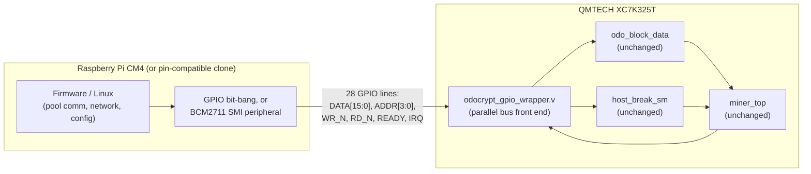

# AM01 + QMTECH Kintex-7 (XC7K325T) + Raspberry Pi CM4 variant

Status: **proposal / work in progress**, not a verified hardware revision.
This sketches a second alternate AM01 build, alongside `hardware/zynq/`,
using off-the-shelf boards instead of a custom PCB:

- [QMTECH XC7K325T dev/core board](https://www.aliexpress.com/) (Kintex-7,
  XC7K325T-1FFG676C) — ~$100, see its user manual for the full pin/schematic
  reference this doc is built from.
- A Raspberry Pi Compute Module 4 (or a pin-compatible clone, e.g. Orange Pi
  CM4), plugged into the QMTECH board's onboard CM4 socket.

Unlike `hardware/zynq/`, this isn't "ARM cores fused into the FPGA die" —
it's a **real ARM SoC on a separate, socketed module, wired to the FPGA
over 28 general-purpose GPIO lines** instead of on-chip AXI. Cheaper and
buildable from parts you can order today; slower/lower-level link than a
true Zynq PS↔PL fabric connection.

## Related prior art

[colneech-dev/odo-miner-cyclonev](https://github.com/colneech-dev/odo-miner-cyclonev)
is a **deployed, hardware-verified** instance of this exact pattern — a
QMTECH board (Cyclone V SoC, so Intel/Altera HPS+FPGA instead of a
CM4+Kintex-7 pair) autonomously mining OdoCrypt with the pool client
running on the on-board ARM cores. It's mined 485+ blocks on mainnet.
Several numbers and lessons below (clock target, the register-map-drift
warning, the nonce-delivery CDC gap) are pulled directly from that
project's docs, since it's real-world validation this repo doesn't have
yet. Its `docs/register-map.md` and `docs/uio-miner-io-scope.md` are
worth reading in full if you're implementing the pieces this repo only
sketches.

## Why this board

From the QMTECH user manual (`QMTECH XC7K325T DEV BOARD USER MANUAL V01`):

| Resource | XC7K325T-1FFG676C | vs. AM01's XC7A200T |
|---|---|---|
| Logic cells | 326,080 | 215,360 |
| Block RAM | 16,020 Kb (≈445 x 36Kb tiles) | ≈365 tiles |
| DSP48 slices | 840 | 740 |

Same "7-series" architecture family as the AM01's Artix-7 (same MMCME2 /
IOBUF / GTXE2 primitives), so `encrypt.v`, `keccak800.v`, `miner.v`,
`odo_block_data`, `host_break_sm` from `exmaples/odocrypt/fpga/src/hdl/`
port over unmodified — same conclusion as the Zynq doc. BRAM is the
binding resource for parallel hash-core instances (211 tiles/instance per
`exmaples/odocrypt/fpga/utilization.txt`), so this chip fits **~2
instances (~2x hashrate)** vs. today's single instance on the AM01.

**A real cross-referenced hashrate number, not a guess:** `miner.v` here
*is* the upstream `THROUGHPUT 4` pipelined `odo_encrypt` core (MentalCollatz,
the same design [colneech-dev/odo-miner-cyclonev](https://github.com/colneech-dev/odo-miner-cyclonev)
ported to a QMTECH Cyclone V SoC board). That project's Quartus build of
this exact core hit **Fmax = 162.1MHz** on comparable-class fabric (~110K
LE) and is deployed on real hardware at **156.25MHz → 26.0 MH/s**
(`THROUGHPUT` was later raised to 6 there for a co-fit tradeoff; the
upstream reference point is 150MHz/`THROUGHPUT=4` → **37.5 MH/s per
instance**). `clk_gen_hash.v` targets that 150MHz reference clock — Xilinx
7-series -1 speed grade should have at least as much timing headroom as
that Cyclone V part, but this is still a cross-vendor estimate, not a
Vivado STA result for this wrapper on this XC7K325T. At 2 instances (BRAM-
bound, per above) that's a ballpark **~75MH/s**, *if* someone builds the
multi-instance arbitration `odocrypt_gpio_wrapper.v` doesn't have yet (it
drives one `miner_top`) — treat this as a target to verify, not a promise.

Board specifics that matter for this design (from the manual):
- On-board 50MHz crystal, `SYS_CLK_F22` (ball **F22** by the schematic's
  own net-naming convention) — feeds an on-FPGA MMCM the same way AM01's
  external `gclk` oscillator does today.
- On-board S25FL128L SPI flash (16MB) for bitstream boot, M0:M1:M2 =
  1:0:0 (boot from SPI flash) — standard 7-series config, no surprises.
- On-board core power: MP8712 buck converter, up to 12A continuous on the
  1.0V core rail from a 2A@6V (12W) DC input — a real, documented power
  budget, not a bare-minimum dev-board trickle supply.
- **A Raspberry Pi CM4 socket** (two 100-pin connectors) wired directly to
  28 FPGA GPIOs (table below) — this is what replaces the Cypress FX3 /
  DQ-bus link the stock AM01 uses.

## Architecture

This is functionally the same "separate ARM SoC next to the FPGA"
architecture we considered as an alternative to the Zynq redesign, except
it's already-built hardware: no custom schematic, no PCB fab. The
trade-off is the link itself — general-purpose GPIO instead of on-chip
AXI, so `odocrypt_gpio_wrapper.v` implements its own small parallel-bus
protocol rather than being an AXI4-Lite slave.

## GPIO bus pinout (from the QMTECH manual's CM4 GPIO table)

28 lines are wired CM4↔FPGA; this design uses 24 of them, leaving 4 spare:

| Signal | GPIO(s) | XC7K325T pin(s) |
|---|---|---|
| `DATA[15:0]` | GPIO0–15 | C12,B11,C18,D18,E18,C11,D10,B12,A12,D14,C13,D13,A10,E10,C17,A15 |
| `ADDR[3:0]` | GPIO16–19 | B10,D16,B15,B9 |
| `WR_N` (active low) | GPIO20 | A9 |
| `RD_N` (active low) | GPIO21 | A8 |
| `READY` (FPGA→CM4) | GPIO22 | C14 |
| `IRQ` (FPGA→CM4, level) | GPIO23 | A14 |
| *reserved* | GPIO24–27 | B14,A13,C9,D15 |

See `xdc/qmtech_xc7k325t_pinout.xdc` for the actual constraints (LVCMOS33,
matching the manual's stated default 3.3V bank supply — **verify this
against the board's schematic for these specific balls before flashing**,
since the manual's bank-voltage section documents BANK12 explicitly but
not which bank each CM4 GPIO ball sits in).

## Protocol / register map

> **Single source of truth.** Any change to the table below MUST be
> matched in `hdl/odocrypt_gpio_wrapper.v` and `cm4-firmware/am01_gpio_bus.c`
> in the same commit. This isn't a formality: odo-miner-cyclonev's own
> register-map doc calls register-map/wrapper drift **"the #1 bring-up
> failure mode"** for this exact kind of project, and their firmware and
> RTL don't have automated drift protection — that's on the "still needed"
> list below, not something to assume is covered.

A simple 4-phase (fully interlocked) parallel bus, safe regardless of how
fast/slow the CM4 side drives it — whether that's bit-banged GPIO in
software or the BCM2711's SMI (Secondary Memory Interface) peripheral,
which the QMTECH manual explicitly calls out as an option for "faster
communication speed":

1. CM4 drives `ADDR` (+ `DATA` on a write), then asserts `WR_N` or `RD_N` low.
2. FPGA captures/produces the data, asserts `READY`.
3. CM4 sees `READY`, releases `WR_N`/`RD_N` high.
4. FPGA sees the strobe released, drops `READY`. Bus is idle again.

Registers are 16 bits/beat (matching the 16-wide `DATA` bus); the 32-bit
header/target words and golden nonce take two beats (LO then HI), same
idea as the Zynq wrapper's register map but split to fit this bus width:

| `ADDR` | Name | Access | Meaning |
|---|---|---|---|
| 0 | `VERSION` | RO | Build/version tag |
| 1 | `CTRL` | WO (pulse bits) | bit0 `SOFT_RST`, bit1 `HOST_BREAK` |
| 2 | `STATUS` | RO | bit0 `HASH_ACTIVE`, bit1 `NONCE_VALID` |
| 3 | `NONCE_LO` | RO | Golden nonce, low 16 bits |
| 4 | `NONCE_HI` | RO | Golden nonce, high 16 bits; **reading this clears `NONCE_VALID`/`IRQ`** |
| 5 | `HEADER_LO` | WO | Next header word, low 16 bits (staged) |
| 6 | `HEADER_HI` | WO | High 16 bits; **writing this commits the 32-bit word** into `odo_block_data`'s header shift chain (write 19 times total) |
| 7 | `TARGET_LO` | WO | Next target word, low 16 bits (staged) |
| 8 | `TARGET_HI` | WO | High 16 bits; **commits** the word (write 8 times total; the 8th arms `start_hash`) |
| 9–15 | *reserved* | — | — |

Firmware flow is the same shape as the Zynq variant: write 19 header
words (LO then HI each) → write 8 target words (LO then HI each) → poll
`STATUS` or wait on `IRQ` → read `NONCE_LO` then `NONCE_HI`.

`odocrypt_gpio_wrapper.v` bridges this bus (run off the board's onboard
50MHz system clock, or an MMCM-derived faster clock) into the hash-core
clock domain via the same toggle/ack synchronizer pattern used in
`hardware/zynq/hdl/odocrypt_axi_wrapper.v` — one write commit or read
completes at a time, so the request/data lines are guaranteed stable
across the clock-domain crossing without needing a heavier CDC FIFO.

## Repo layout

- `xdc/qmtech_xc7k325t_pinout.xdc` — pin constraints (bus, clock, LEDs, keys).
- `hdl/odocrypt_gpio_wrapper.v` — the parallel-bus front end + CDC bridge.
- `hdl/clk_gen_hash.v` — hash-core clock (MMCME2_BASE off the 50MHz crystal).
- `hdl/am01_qmtech_top.v` — top level wiring the above together, plus
  bring-up status LEDs (MMCM-locked, clk_h heartbeat).
- `vivado/build.tcl` — non-interactive Vivado project generator
  (`vivado -mode batch -source build.tcl`); no IP Integrator needed.
- `cm4-firmware/` — bit-banged GPIO driver (libgpiod) for the CM4 side:
  `am01_gpio_bus.[ch]` (the library) + `am01_bus_test.c` (bring-up CLI) +
  `Makefile`. See its own README for build/run instructions.
- `case/` — a parametric OpenSCAD 3D-printable case for the QMTECH board
  itself: a fully enclosed two-part box (tray + lid) in three variants
  (sealed / vented / tall-XL), sized around a real BGA heatsink, with
  connector cutouts on the three walls the board's I/O actually uses.
  See its own README for the design assumptions and print notes.
- `openxc7/` — **Vivado-free build flow, verified to produce a real
  `.bit` for this board's exact chip.** Scripts to generate the
  Kintex-7 chipdb (which no toolchain ships prebuilt) and run
  yosys → nextpnr-xilinx → fasm2frames → xc7frames2bit, plus a smoke-test
  design. See its README — there are two gotchas that will otherwise cost
  you a day.

## What's still needed before this is real hardware

Design/RTL and a first-cut CM4 driver exist now (above); what's left is
verification against real parts, not more design work:

1. ~~CM4-side software~~ — done as a first cut: `cm4-firmware/` implements
   the bit-banged path. The BCM2711 SMI peripheral (faster, more setup:
   device-tree overlay + `/dev/smi` or a small kernel driver) is still a
   TODO, worth doing only if the bit-banged path turns out too slow.
2. **CDC and timing signoff** — the synchronizers on `WR_N`/`RD_N`/`ADDR`/
   `DATA` need `ASYNC_REG` constraints and proper timing exceptions, same
   caveat as the Zynq wrapper. `clk_gen_hash.v`'s `CLKOUT0_DIVIDE` now
   targets 150MHz (cross-referenced from odo-miner-cyclonev's Quartus
   build of the same `miner.v` core, see above) rather than an arbitrary
   guess, but it's still not a Vivado STA result for this exact wrapper —
   re-verify and retune once you can synthesize it.
3. ~~Verify the GPIO bank/voltage for the 28 CM4-linked balls~~ — **done**,
   against the vendor's own schematic and prjxray-db's package data rather
   than the manual. Results (details in `xdc/qmtech_xc7k325t_pinout.xdc`'s
   header):
   - All 30 `PACKAGE_PIN`s in the .xdc are **real balls** on ffg676,
     checked against `package_pins.csv` for `xc7k325tffg676-1`.
   - Bank rails, from schematic sheet 4's `U11Q` VCCO block: banks
     **0/13/14/15/16 → 3V3**, bank **12 → VCCO_12** (itself tied to 3V3
     through the 0R links R31/R32), banks **32/33 → 1V8**, bank
     **34 → 1V5**. The 1V8/1V5 banks are the DDR3 interface, which this
     variant doesn't use.
   - Every signal this .xdc constrains lands in banks 12–16, i.e. all on
     3.3V rails, so **`LVCMOS33` throughout is correct**.
   - **A previous revision of this repo got this wrong**: it set
     `SW2`/`SW3` to `LVCMOS18`, claiming their pull-ups went to 1.8V.
     They actually go to `VCCO_12`, which is 3V3 — and both balls (U26,
     V26) are in bank 12, whose VCCO *is* that same rail. Wrong on two
     independent counts; corrected to `LVCMOS33`. (Declaring a 1.8V
     standard on a 3.3V-powered bank is a Vivado DRC error, and a
     reliability problem if forced through.)
4. ~~New Vivado project~~ — done: `vivado/build.tcl` scaffolds it from the
   command line (no IP Integrator block design; clocking is hand-written
   MMCME2_BASE in `hdl/clk_gen_hash.v`). Not run against real Vivado as
   part of this repo (no license/install in this environment), so treat
   it as unverified until someone runs it.

   **This matters more than it looks, because there is no free Vivado for
   this chip.** Vivado ML Standard (the free tier, ex-WebPACK) covers
   Artix-7, Spartan-7, some Zynq-7000 and only the *smaller* Kintex-7
   parts — the XC7K325T needs a paid licence (~$4,395 node-locked at last
   check; AMD moved to new tiered pricing in 2026.1). The stock AM01's
   XC7A200T is free to build; this board's chip is not.

   ~~openXC7 is worth a look~~ — **evaluated, and it works**: a fully
   open-source flow now takes Verilog to a valid `.bit` for
   `xc7k325tffg676-1`. See **[`openxc7/`](openxc7/)** for the scripts and
   the two non-obvious gotchas (no prebuilt Kintex-7 chipdb exists — you
   generate it; and a from-source `nextpnr-xilinx` 0.9.2 build fails to
   route, so use apio's prebuilt binary). The `.xdc`/RTL here were
   written for Vivado's constraint syntax and 7-series primitives
   (`MMCME2_BASE`, `IBUF`, `BUFG`); the .xdc subset used by the smoke
   test parsed fine under nextpnr, but **the real `am01_qmtech_top` has
   not yet been through the openXC7 flow** — only a trivial counter has.
5. **Physical assembly**: seat the CM4 module, confirm `JP6` jumper state
   per the manual (open when a CM4 is installed, since pins 86/88 are
   power outputs from the module), and power the board from a 6V/2A+
   supply.
6. **A real pool/stratum client** on the CM4 side to feed
   `am01_bus_submit_work()` real work instead of `am01_bus_test.c`'s
   all-zero dummy — not attempted here, see `cm4-firmware/README.md`.
7. **Nonce delivery is a single-register latch, not a FIFO.** Two
   distinct problems lived here; one is now fixed, one is not.

   *Fixed:* the wrapper consumed `miner_top`'s `ticket2moon` **raw**, in
   two places, despite comments claiming it mirrored
   `atomminer_odocrypt.v`. That signal is the bare combinational
   "hash meets target" comparator (`miner.v`: `assign ticket2moon = res`)
   — not warm-up-gated, and a level rather than a pulse. The reference
   never uses it raw; it feeds `ticket2moon & nonce_out_go_top` to both
   consumers. Using it raw meant a spurious pre-warm-up assertion could
   latch a nonce that `miner.v` hadn't validly captured yet, *and* reach
   `host_break_sm` — which decides when to stop hashing, so it could
   stall the miner rather than just corrupt a result. Because the signal
   is a level, it could also flip the CDC toggle on every cycle it stayed
   high, letting `golden_nonce_latch_h` move while the bus side was
   sampling it (a **torn** nonce, worse than a lost one). Now gated
   exactly as the reference does, plus a one-shot edge detect for this
   wrapper's toggle-based CDC. Verified by synthesis, **not** simulated
   against the real core or run on hardware.

   *Still open:* even with clean delivery, this is one register, not a
   queue — if two nonces arrive faster than the CM4 drains `NONCE_HI`,
   the second still overwrites the first (see
   `odocrypt_gpio_wrapper.v`'s `golden_nonce_reg`/`nonce_valid_reg`), and
   nothing reports that it happened.
   At `miner_top`'s actual expected solve rate for real pool difficulty
   this is unlikely to bite in practice, but it's a real gap, not a
   theoretical one: odo-miner-cyclonev hit exactly this class of problem
   and fixed it with a **depth-8 dual-clock async FIFO (Gray-code
   pointers) plus a sticky overflow bit** in `STATUS` — see their
   `docs/register-map.md` §4 for the pattern if this needs closing before
   going into real use.
