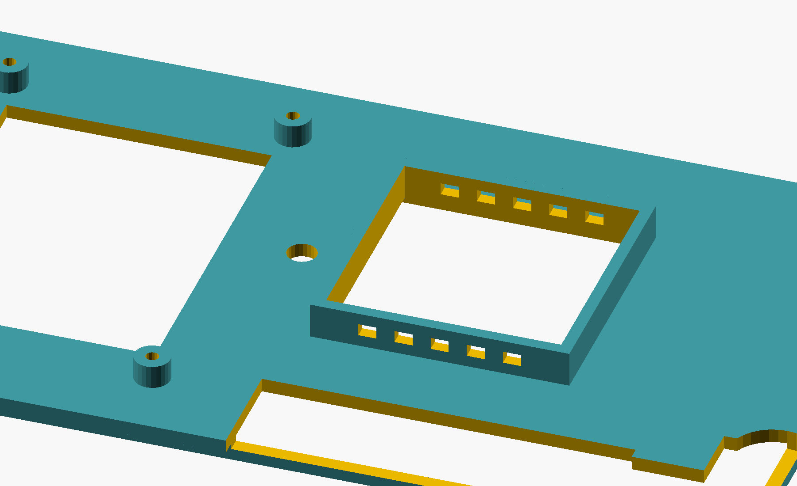

# QMTECH XC7K325T dev board -- 3D-printable case (v3, two-part + chimney)

A two-part case (base tray + closed lid) for the
[QMTECH XC7K325T dev board](../README.md), sized from the vendor's own
real ECAD dimension export. Parametric OpenSCAD, FDM-print friendly (no
supports needed).




## v3: corrections after review

v2 had two real problems, both fixed here:

1. **The CM4 had a cutout it didn't need.** The CM4 mates to this board
   over two low-profile 100-pin board-to-board connectors (1.5mm or
   3.0mm stack height per the [Raspberry Pi CM4 datasheet](https://datasheets.raspberrypi.com/cm4/cm4-datasheet.pdf)),
   and the module itself is only 4.7mm thick -- **total ~6.2-7.7mm above
   the carrier board.** That's a fully internal, low-profile mezzanine,
   not something needing a panel opening: its HDMI/USB/Ethernet/etc. are
   already broken out to *this* board's own edge connectors (which
   `left_edge_cutouts()` already handles). **The CM4 cutout is removed
   in v3** -- `general_clearance_mm` (11mm) covers the CM4 stack with
   margin to spare, no opening required.
2. **The heatsink height was an unsourced guess (v2's flat 28mm),
   applied to the whole case.** v3 uses a real part: **Ohmite/Arcol
   BGAH270-175E**, 27x27x17.5mm -- a BGA heatsink dimensioned for
   exactly this chip's FFG676 package body (27x27mm). Rather than make
   the *entire* case that tall, v3 is short everywhere (14mm walls,
   sized for the CM4 stack) with a **raised, open-top, vented chimney**
   directly over the FPGA reaching the extra height the heatsink
   actually needs (`chimney_protrusion_mm`, derived from the heatsink's
   real dimensions -- see the .scad header). The chimney's front/back
   walls have vent slots for passive convection airflow.

Along the way, [ChinaQMTECH/QMTECH_Kintex-7_Development_Board](https://github.com/ChinaQMTECH/QMTECH_Kintex-7_Development_Board)
turned up -- the vendor's own repo, with `hardware/Dimension(Board_Top_View).pdf`,
a real Allegro ECAD dimension export (not a manual excerpt). It
confirmed the FPGA's rough position (used to place the chimney) and the
general header/DC-jack/switch layout on the top edge. It's a real
improvement over the photo-proportional guessing v1/v2 relied on, but
still not exact vector coordinates for every feature -- see "still
estimates" below.

## Files

- `qmtech_xc7k325t_case.scad` -- parametric source, both parts.
- `base_tray.stl` / `lid.stl` -- exported meshes, ready to slice
  separately (recommended over a shared plate).

## Design decisions (read before printing)

1. **Hole/cutout positions are still estimates**, just better-sourced
   ones now (see above). Every cutout is deliberately oversized
   (`cutout_margin`) to absorb that. Adjust `lid_top_cutouts_mm`,
   `dc_jack_center_mm`, `heatsink_center_mm`, `sensor_hole_center_mm`,
   or `display_center_mm` and re-render if something doesn't line up
   once you have the board.
2. **Heatsink math is traceable, not a magic number.**
   `chimney_protrusion_mm` is computed from the BGAH270-175E's real
   17.5mm height plus a chip/thermal-pad allowance and an assembly
   margin, minus what the general case height already provides -- see
   the "FPGA heatsink chimney" parameter block in the .scad. If you use
   a different heatsink, update `heatsink_lwh_mm` and everything
   downstream (footprint, bore, chimney height) recomputes.
3. **Display and sensor part numbers are borrowed from a different
   board, not verified against this one.** The KMRTM28028-SPI (2.8"
   ILI9341+XPT2046) and DS18B20 are what
   [odo-miner-cyclonev](https://github.com/colneech-dev/odo-miner-cyclonev)
   uses and verified on real hardware -- a different Cyclone V SoC
   board, not this Kintex-7 one. `display_pcb_mm`/`display_hole_spacing_mm`
   here are typical dimensions for that class of 2.8" SPI TFT module,
   not a datasheet lookup for this exact part. **No RTL or driver
   software for either exists anywhere in this repo** -- this case only
   adds the physical mounting. Wiring a display needs more signal lines
   (CS/DC/RST/SCLK/MOSI/MISO + touch CS/IRQ) than the 4 spare CM4 GPIO
   lines (`hdl/odocrypt_gpio_wrapper.v` uses GPIO0-23) provide, so the
   realistic path is the board's 50-pin extension header (JP5) -- not
   attempted here. The display is mounted **portrait** (rotated 90° from
   its natural orientation) because that's the only way it fits the
   free space left once the header/DC-jack cluster and the heatsink
   chimney are laid out -- verified with explicit numeric range-checks,
   not by eyeballing a render (see the collision bug below).
4. **Board retention and standoffs**: unchanged since v1 -- a perimeter
   lip is the primary retention (works regardless of where the real
   mounting holes are), 4 corner standoffs are a secondary
   generic-default fixation, not transcribed with confidence from any
   dimension drawing.
5. **Lid attachment**: a friction-fit alignment skirt seats inside the
   tray's top opening, secured by 4 corner screws (M3 self-tap or
   heat-set insert) into full-height bosses, separate from the shorter
   board-support standoffs.
6. **Square corners**, same reason as v1/v2: `hull()`-based rounding
   previously produced CGAL boolean geometry where cutout subtraction
   silently didn't intersect -- confirmed by A/B vertex-count testing.
   This file never used rounding to begin with.
7. **Bugs caught and fixed during development** (all verified
   numerically, not just visually):
   - v2: a fusion bug (lid skirt / display standoffs touching the lid
     panel at an exact coincident Z-plane instead of genuinely
     overlapping) -- fixed with `fuse_eps` overlaps.
   - v2: a layout bug -- the first draft's flat ventilation grille and
     sensor hole overlapped the (now-removed) CM4 cutout's footprint.
   - v3: repositioning the display after removing the CM4 cutout and
     adding the chimney required re-deriving free space from scratch;
     done with explicit coordinate range checks (written out in the
     .scad's display section) rather than trial-and-error rendering.
8. **Print a fit-check first** -- these are estimates, better-sourced
   than v1/v2 but still estimates.

## Print settings

0.2mm layers, 15-20% infill, no supports (everything overhangs at 90°
from a flat base or less on both parts, including the chimney -- it's a
simple upward-extruded wall, no bridging). PETG or ABS given there's now
an actual heatsink in the design -- PLA's ~55-60°C heat deflection is a
real concern this close to one.

## Regenerating

```sh
openscad -o base_tray.stl qmtech_xc7k325t_case.scad   # after commenting out lid();
openscad -o lid.stl qmtech_xc7k325t_case.scad          # after commenting out base_tray();
```
Or export both on one plate as-is (pre-offset apart in the source).
Requires OpenSCAD 2021.01+, no other dependencies.
