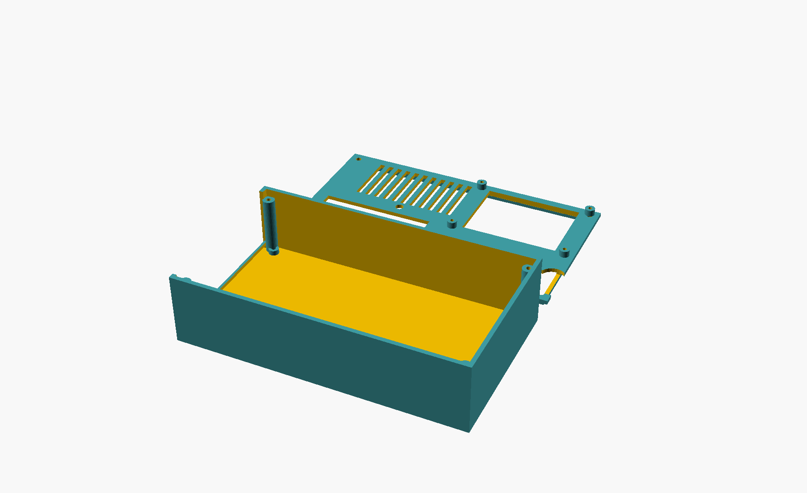
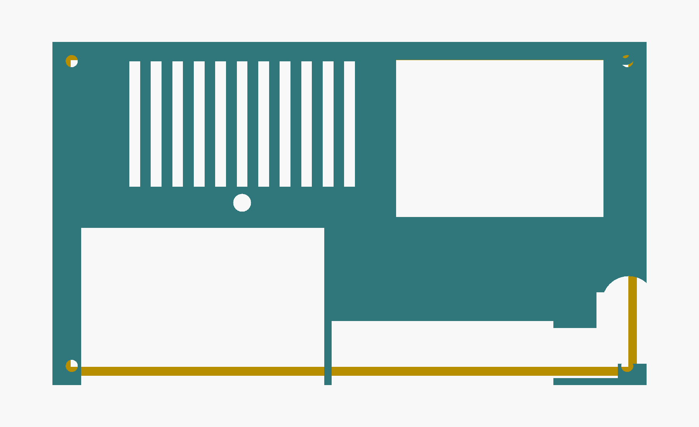

# QMTECH XC7K325T dev board -- 3D-printable case (v2, two-part)

A two-part case (base tray + closed lid) for the
[QMTECH XC7K325T dev board](../README.md), sized from the board's own
user manual (Figure 2-1: 160mm x 90mm outline). Parametric OpenSCAD,
FDM-print friendly (no supports needed).




## What changed from v1

v1 was an open-top tray with the entire top edge left unwalled. Based on
feedback, v2 is a proper enclosure:

1. **Closed lid with discrete holes**, not an open face. The CM4
   connector, 3 pin headers, DC barrel jack, micro-USB, and switch
   cluster each get their own cutout in the lid instead of one big open
   edge.
2. **Taller**, to clear a heatsink on the Kintex-7 — `component_clearance_mm`
   (default 28mm, reserved height above the board's top surface) replaces
   v1's flat 16mm wall height, which only accounted for connector height.
3. **Display + thermal-sensor mounting**, matching
   [colneech-dev/odo-miner-cyclonev](https://github.com/colneech-dev/odo-miner-cyclonev)'s
   own real, hardware-verified build for this class of appliance:
   - A cutout + 4 standoffs sized for a **KMRTM28028-SPI** (2.8" 240x320
     ILI9341 + XPT2046 touch, 14-pin header) — the exact module that
     project verified on real hardware.
   - A cable pass-through hole for a **DS18B20** (TO-92, 3-wire) thermal
     sensor near a ventilation grille over the FPGA.

## Files

- `qmtech_xc7k325t_case.scad` -- parametric source, both parts.
- `base_tray.stl` / `lid.stl` -- exported meshes, ready to slice
  separately (recommended — most slicers handle one object per file more
  predictably than a shared plate).

## Design decisions (read before printing)

1. **Hole positions are still estimates.** Same caveat as v1: the CM4
   connector, headers, DC jack, micro-USB, switch, display, and vent
   positions are read proportionally off the manual's cover photo, not
   measured — none of it is in the manual's dimensioned drawing. Every
   cutout is deliberately oversized (`cutout_margin`) to absorb that.
   Adjust `lid_top_cutouts_mm`, `dc_jack_center_mm`, `vent_center_mm`,
   `sensor_hole_center_mm`, or `display_center_mm` and re-render if
   something doesn't line up once you have the board.
2. **Heatsink clearance is a placeholder, not a datasheet number.**
   `component_clearance_mm` (28mm) is a reasonable default for a common
   passive Kintex-7 heatsink, not measured against any specific one you
   own. Tune it before printing if your heatsink is taller/shorter.
3. **Display and sensor part numbers are borrowed, not verified against
   this board.** The KMRTM28028-SPI and DS18B20 are what
   `odo-miner-cyclonev` uses and verified on its own (different) board;
   `display_pcb_mm`/`display_hole_spacing_mm` here are typical dimensions
   for that class of 2.8" SPI TFT module, not a datasheet lookup for this
   exact part. **No RTL or driver software for either exists anywhere in
   this repo** — this case only adds the physical mounting. Wiring a
   display needs more signal lines (CS/DC/RST/SCLK/MOSI/MISO + touch
   CS/IRQ) than the 4 spare CM4 GPIO lines
   (`hdl/odocrypt_gpio_wrapper.v` uses GPIO0-23) provide, so the
   realistic path is the board's 50-pin extension header (JP5) — not
   attempted here.
4. **Board retention and standoffs**: unchanged from v1 — a perimeter lip
   is the primary retention (works regardless of where the real mounting
   holes are), 4 corner standoffs are a secondary generic-default
   fixation.
5. **Lid attachment**: a friction-fit alignment skirt on the lid's
   underside seats inside the tray's top opening, secured by 4 corner
   screws (M3 self-tap or heat-set insert) into full-height bosses
   separate from the shorter board-support standoffs.
6. **Square corners**, same reason as v1: `hull()`-based rounding
   previously produced CGAL boolean geometry where cutout subtraction
   silently didn't intersect — confirmed by A/B vertex-count testing.
   This file never used rounding to begin with, and a second, unrelated
   fusion bug (parts touching at an exact coincident Z-plane instead of
   genuinely overlapping) was caught and fixed the same way during v2
   development (`fuse_eps` overlaps on the lid skirt and display
   standoffs).
7. A real layout bug was caught and fixed during v2 development: the
   first draft's ventilation grille and sensor hole overlapped the CM4
   connector cutout's footprint. Verified fixed by rendering the lid
   alone from directly above (`preview_lid_top.png`) — vent grille,
   sensor hole, CM4 cutout, and display cutout all land in separate,
   non-overlapping regions.
8. **Print a fit-check first**, same as v1 — these are estimates.

## Print settings

0.2mm layers, 15-20% infill, no supports (everything overhangs at 90°
from a flat base or less on both parts). PETG or ABS if the board runs
hot enough near the FPGA/heatsink that PLA's ~55-60°C heat deflection
becomes a concern.

## Regenerating

```sh
openscad -o base_tray.stl qmtech_xc7k325t_case.scad   # after commenting out lid();
openscad -o lid.stl qmtech_xc7k325t_case.scad          # after commenting out base_tray();
```
Or export both on one plate as-is (they're pre-offset apart in the
source). Requires OpenSCAD 2021.01+, no other dependencies.
