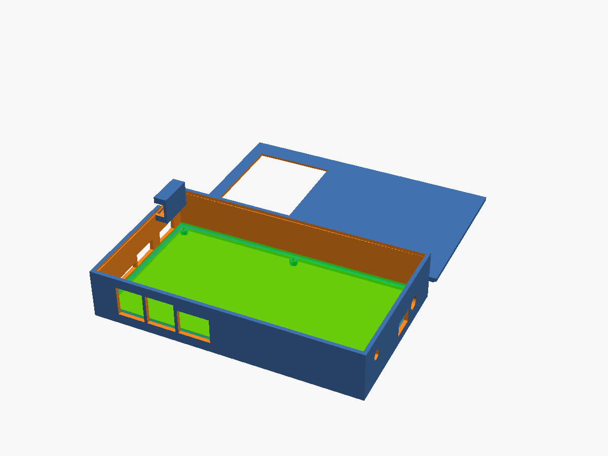
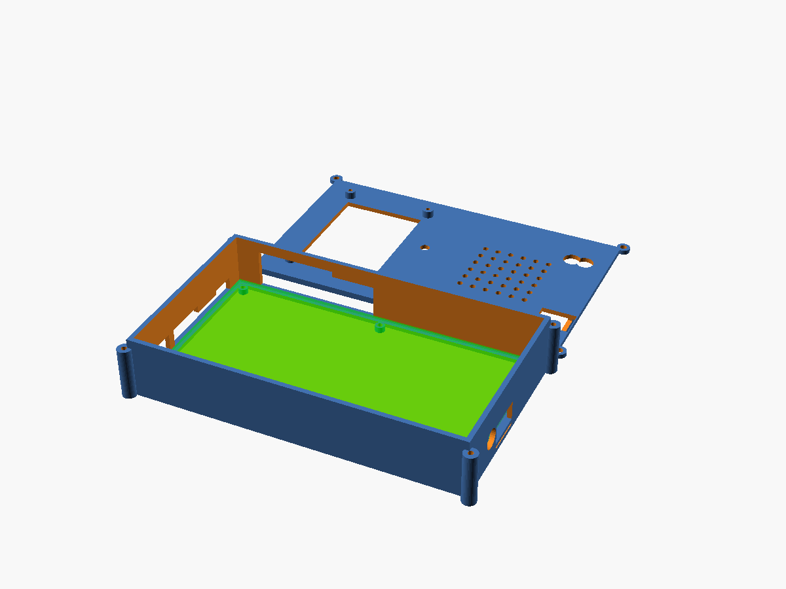
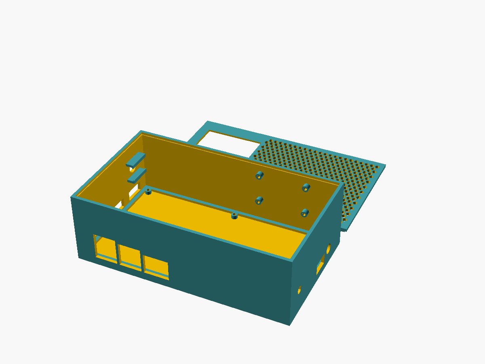

# QMTECH XC7K325T dev board -- 3D-printable case (v4.1, real I/O)

A two-part case (base tray + closed lid) for the
[QMTECH XC7K325T dev board](../README.md), sized from the vendor's own
real ECAD dimension export. Parametric OpenSCAD, FDM-print friendly (no
supports needed).

## v4.1: the I/O is now real, not a photo guess

v4 made the box fully enclosed (fixed) but still placed every connector
from **estimates read off the manual's cover photo**. Going back and
actually reading the vendor's own 5-sheet schematic
(`QMTECH-XC7K325T-DEVELOPMENT-BOARD_SCHEMATIC_20231120_V01.pdf`) and
their real ECAD placement export
(`hardware/Dimension(Board_Top_View).pdf`, rendered at 600dpi and read
directly, ref-des by ref-des) turned up real errors, not just
imprecision:

- ~~**This board has no Ethernet jack.**~~ **RETRACTED -- the jack is real,
  and v4.1 wrongly removed its cutout.** The reasoning below was that the
  schematic's Ethernet section (HR911130A RJ45 magjack, wired to the CM4's
  MDI pairs through the B2B connector) had no matching footprint in the
  vendor's placement drawing, so it must be an unpopulated reference block.

  That inference was wrong. The user manual
  (`../reference/QMTECH_Kintex-7_XC7K325T_Development_Board_User_Manual(Hardware)_V01.pdf`)
  shows the HanRun HR911130A populated in every board photograph, including
  Figure 2-3 and the CM4-docked photo in section 2.2.9, and that section
  lists "ethernet interface" among the CM4 interfaces the board provides.
  Absence from one drawing was treated as evidence of absence; the photos
  and the interface list both say otherwise.

  **Known defect:** there is consequently no RJ45 opening in the current
  model -- the cutout was deleted, and nothing in the `.scad` replaces it.
  Restoring it needs the jack's real position off the placement drawing,
  the same way the other connectors were sourced. Until then a printed case
  blocks the Ethernet port.
- **Four USB-A ports, not two.** J6 and J7 are each a stacked
  "Dual USB-A" shell (2 ports per connector), fed by a real USB2514QFN36
  hub chip off the CM4's single USB2 OTG line, plus a separate mini-USB
  (J14) for OTG/debug. v4 only modeled "USB_1"/"USB_2" + one micro-USB.
- **The I/O is spread across three walls, not one.** HDMI0/HDMI1 (P3/P4)
  and the micro-SD slot (J9) are on the **left** wall (roughly right
  already). But mini-USB + all 4 USB-A ports + a 100-pin GPIO expansion
  header (JP5) are on the **bottom** wall -- v4 had zero cutouts there.
  The DC power jack (JP1) is edge-mounted on the **top** wall -- v4 had
  it as a lid-panel hole 20mm inset, which is wrong for a barrel jack
  (the cable has to approach from outside the case horizontally, not
  drop in from above).
- **Added the JP5 GPIO header cutout.** The doc already pointed at JP5
  as the realistic path for wiring a display/sensor (see design note 6
  below) but v4 never actually gave it a case opening to route a cable
  through. It has one now (`GPIO_HDR_JP5` in
  `bottom_connector_positions_mm`).
- **Added SW2/SW3.** Real user push-buttons already referenced in
  `../xdc/qmtech_xc7k325t_pinout.xdc` (the IOSTANDARD fix mentioned
  there) -- v4 didn't expose them at all. Small lid holes now.
- The 3 general-purpose headers (J11/J12/J13, real ref-des now instead
  of "HEADER_1/2/3") were genuinely right to be lid cutouts (pins point
  up) -- that part of v4 stood, positions nudged once real coordinates
  were available. The FPGA's position (`heatsink_center_mm`) was also
  refined from "roughly the board center" to U11's real BGA footprint.
- **Walls weren't actually full sides.** Every wall cutout, all the way
  back to v1, cut a Z-height of `wall_height + cutout_margin + 2` --
  taller than the wall itself, so every cutout notched through to the
  wall's own top edge instead of sitting inside a solid, continuous
  wall. Easy to miss with 1-2 small cutouts on one wall; obvious once
  the real bottom wall got 4 connectors, several of them merging into
  one big open notch spanning almost half the wall. **Fixed:** each
  cutout now uses a real connector body height (a 4th field in the
  position tables) and is capped by `wall_cutout_h()` so it never eats
  into the last `wall_roof_min_mm` (3mm) of the wall -- every side now
  keeps a genuinely continuous, full top edge, confirmed by rendering
  each wall from directly outside (see `v4-sealed/preview_bottomwall_detail.png`:
  both bottom-wall windows sit inside solid material on every side, not
  notched open at the top).

Everything from v4 that wasn't about I/O positions is unchanged: fully
enclosed box (no open-top chimney), uniform wall height sized to clear
the real heatsink everywhere, optional venting via a perforated lid
panel (never an opening), no CM4 panel cutout (still a low-profile
mezzanine), square corners (still no `hull()` rounding).

## Three variants

All three share one template (`VARIANT_WALL_HEIGHT` / `VARIANT_VENTED`
knobs at the top of each `.scad`) and differ only in those two numbers.

| Variant | Dir | Wall height | Venting | Heatsink margin | Use when |
|---|---|---|---|---|---|
| **Sealed** | `v4-sealed/` | 24mm | none, fully solid | 3.9mm | passive cooling is enough, or you want a dust/splash-resistant box |
| **Vented** | `v4-vented/` | 24mm | 5x5 grid of 3mm holes over the FPGA | 3.9mm | same size as Sealed, adds passive convection through the perforated lid |
| **Tall-XL** | `v4-tall-xl/` | 36mm | same 5x5 vent grid | 15.9mm | bigger/aftermarket heatsink, or a fan sits in the extra headroom above the stock one |





Each directory is self-contained:
- `qmtech_xc7k325t_case_<variant>.scad` -- parametric source for that variant
- `base_tray.stl` / `lid.stl` -- exported meshes, ready to slice separately
- `preview_isometric.png` -- render showing tray (open, left) + lid (right).
  The round hole visible on the tray's near wall in these renders is the
  DC jack (JP1) -- real evidence the wall cutout is actually being cut,
  not silently failing (see the `hull()` bug this project hit in v1).

Regenerate any of them:
```sh
openscad -o base_tray.stl qmtech_xc7k325t_case_<variant>.scad   # comment out lid() first
openscad -o lid.stl qmtech_xc7k325t_case_<variant>.scad          # comment out base_tray() first
```
Or export both parts side-by-side as-is (the file already offsets them
apart for a shared plate). Requires OpenSCAD 2021.01+, no other
dependencies.

To make a 4th variant of your own: copy any of the three `.scad` files,
change `VARIANT_WALL_HEIGHT`/`VARIANT_VENTED` at the top, re-render. All
downstream geometry recomputes from those two numbers.

## Heatsink: BGAH270-175E on AliExpress

Searched AliExpress specifically for the **Ohmite/Arcol BGAH270-175E**
(the exact part these dimensions are drawn from). **Not listed there** --
it's a distributor-only part (RS Components, DigiKey, Mouser, Farnell,
Enrgtech). AliExpress alternatives found in the same class/size
(27x27mm BGA footprint, passive extruded/finned aluminum) but **not
individually verified for exact height or thermal specs** since
AliExpress product pages are blocked from this environment's network
egress -- only search-result snippets were visible, not full listings:

- "WE DO HEATSINK Store" storefront -- carries assorted BGA/FPGA
  heatsinks in this size class.
- Generic "BGA heatsink 27x27mm" category listings -- multiple sellers,
  varying heights (12-25mm typical for this footprint).
- A "Mister FPGA - Heat Sink" listing -- sized for the MiSTer FPGA
  community's own Cyclone V boards, same rough footprint class.

None of these are a confirmed drop-in match for BGAH270-175E's exact
27x27x17.5mm envelope -- **measure before committing to a case variant**.
If your actual heatsink is taller than 17.5mm, use Tall-XL and check the
`heatsink_margin_mm` echo after updating `heatsink_lwh_mm` in the .scad.
Distributor-sourced equivalents in the same class also exist (e.g.
Fischer Elektronik ICK BGA 27x27 series, AAVID/Boyd Thermalloy 27x27x18mm)
if you'd rather buy the real thing than gamble on an unverified AliExpress
listing.

## Design decisions (read before printing)

1. **Hole/cutout positions are read off a real, dimensioned vendor
   drawing now, not a manual cover photo** -- see v4.1 section above for
   what changed. Every ref-des (P3/P4, J6/J7/J9/J14, JP1/JP5, J11-J13,
   SW2-SW4, U11) is a real component this board actually has, read off
   `hardware/Dimension(Board_Top_View).pdf` in
   [ChinaQMTECH/QMTECH_Kintex-7_Development_Board](https://github.com/ChinaQMTECH/QMTECH_Kintex-7_Development_Board)
   (600dpi render) and cross-checked against the real schematic's net
   names. Still not calipers-on-the-real-board precision -- every
   cutout is deliberately oversized (`cutout_margin`) to absorb that.
   Adjust `connector_positions_mm`, `bottom_connector_positions_mm`,
   `dc_jack_x_mm`, `lid_top_cutouts_mm`, `lid_button_positions_mm`,
   `heatsink_center_mm`, `sensor_hole_center_mm`, or `display_center_mm`
   and re-render if something doesn't line up once you have the board.
2. **No CM4 cutout.** The CM4 mates over two low-profile 100-pin
   board-to-board connectors (JP2/JP3, 1.5mm or 3.0mm stack height per
   the [Raspberry Pi CM4 datasheet](https://datasheets.raspberrypi.com/cm4/cm4-datasheet.pdf)),
   module itself 4.7mm thick -- **total ~6.2-7.7mm above the carrier
   board.** Fully internal, low-profile mezzanine; its HDMI/USB/SD/GPIO
   signals all route through JP2/JP3 to *this* board's own real
   connectors (P3/P4/J6/J7/J9/J14/JP5), which the three wall-cutout
   modules (`left_edge_cutouts()`, `bottom_edge_cutouts()`,
   `top_edge_cutouts()`/`top_edge_dc_jack()`) handle. No panel opening
   needed for JP2/JP3 themselves.
3. **Heatsink math is traceable, not a magic number.**
   `heatsink_total_clearance_mm` is the BGAH270-175E's real 17.5mm height
   plus a chip/thermal-pad allowance and an assembly margin.
   `heatsink_margin_mm = (wall_height + lid_thickness) -
   heatsink_total_clearance_mm` -- printed via `echo()` on every render,
   so you can see immediately whether a given wall height still clears a
   different heatsink after editing `heatsink_lwh_mm`.
4. **Venting, if enabled, is a perforated panel, not an opening.**
   `VARIANT_VENTED` drills a grid of 3mm holes through the *solid* lid
   over the FPGA's footprint -- convection through small holes, not an
   exposed bore. `VARIANT_VENTED = false` leaves that area fully solid.
5. **Display and sensor part numbers are borrowed from a different
   board, not verified against this one.** The KMRTM28028-SPI (2.8"
   ILI9341+XPT2046) and DS18B20 are what
   [odo-miner-cyclonev](https://github.com/colneech-dev/odo-miner-cyclonev)
   uses and verified on real hardware -- a different Cyclone V SoC board,
   not this Kintex-7 one. **No RTL or driver software for either exists
   anywhere in this repo** -- this case only adds the physical mounting.
6. **Display/sensor wiring path: JP5, and it now has a case opening.**
   Wiring the display needs more signal lines (CS/DC/RST/SCLK/MOSI/MISO
   + touch CS/IRQ) than the 4 spare CM4 GPIO lines
   (`hdl/odocrypt_gpio_wrapper.v` uses GPIO0-23) provide, so the
   realistic path is the board's real 100-pin GPIO expansion header
   (JP5, on the bottom wall, confirmed to actually exist and be that
   size from the ECAD drawing) -- `GPIO_HDR_JP5` in
   `bottom_connector_positions_mm` gives it a real cutout to route a
   cable through. No RTL/driver exists yet either way.
7. **Board retention and standoffs**: a perimeter lip is the primary
   retention (works regardless of where the real mounting holes are), 4
   corner standoffs are a secondary generic-default fixation, not
   transcribed with confidence from any dimension drawing.
8. **Lid attachment**: a friction-fit alignment skirt seats inside the
   tray's top opening, secured by 4 corner screws (M3 self-tap or
   heat-set insert) into full-height bosses, separate from the shorter
   board-support standoffs.
9. **Square corners.** `hull()`-based rounding previously produced CGAL
   boolean geometry where cutout subtraction silently didn't intersect --
   confirmed by A/B vertex-count testing back in v1. These files never
   use rounding.
10. **Bugs caught and fixed during development** (all verified
    numerically -- vertex/facet/Volumes counts from `--render -o file.stl`
    -- not just visually):
    - v2: a fusion bug (lid skirt / display standoffs touching the lid
      panel at an exact coincident Z-plane instead of genuinely
      overlapping) -- fixed with `fuse_eps` overlaps.
    - v2: a layout bug -- the first draft's flat ventilation grille and
      sensor hole overlapped the (now-removed) CM4 cutout's footprint.
    - v3: repositioning the display after removing the CM4 cutout and
      adding the (now also removed) chimney required re-deriving free
      space from scratch, done with explicit coordinate range checks.
    - v4: confirmed the vent-hole grid actually cuts material and that
      `heatsink_margin_mm` stays positive for both wall heights.
    - v4.1: confirmed with the same A/B vertex-count method that
      disabling the new bottom-wall cutouts changes the tray's vertex
      count (1370 -> 1338) -- a real cut, not a silent no-op. Adjacent
      cutouts (mini-USB + the two dual-USB-A connectors, spaced only a
      few mm apart with `cutout_margin` on each) merge into one
      continuous slot rather than three separate windows -- expected
      given how close J14/J6/J7 sit to each other on the real board, not
      a bug; some enclosures do this deliberately for a USB cluster.
    - v4.1 (2nd pass): every wall cutout back to v1 notched through to
      the wall's own top edge instead of stopping inside solid material
      -- "not full sides". Fixed by capping cutout height with
      `wall_cutout_h()`; confirmed by rendering each wall from directly
      outside the case (not just the usual isometric angle) --
      `v4-sealed/preview_bottomwall_detail.png` shows both bottom-wall
      windows sitting inside solid material on every side.
11. **Print a fit-check first** -- see design note 1, still not
    calipers-verified.

## Print settings

0.2mm layers, 15-20% infill, no supports (everything overhangs at 90° from
a flat base or less on both parts). PETG or ABS given there's an actual
heatsink in the design -- PLA's ~55-60°C heat deflection is a real concern
this close to one, especially in the Sealed variant with no venting.

## History

- **v1**: open-top tray, no lid.
- **v2**: two-part (tray + lid), added connector cutouts, screen/sensor
  mounts, a CM4 panel cutout, and an unsourced flat 28mm wall height.
- **v3**: removed the unnecessary CM4 cutout, replaced the guessed wall
  height with a real heatsink part (BGAH270-175E) driving a short case +
  raised open-top vented chimney over the FPGA.
- **v4**: replaced the open-top chimney with a genuinely closed box --
  uniform height sized to clear the heatsink everywhere, optional
  venting via a perforated lid panel instead of an opening. Three
  variants (Sealed / Vented / Tall-XL) instead of one fixed geometry.
  I/O cutouts were still estimates read off a manual photo, all on one
  wall.
- **v4.1 (current)**: replaced the estimated I/O with real positions
  read from the vendor's own schematic + ECAD placement drawing. Removed
  the RJ45 port (**wrongly -- see the retraction above; the jack is
  populated and its cutout still needs restoring**), added the 2 missing
  USB-A ports, split
  cutouts across the 3 walls the real connectors are actually on, moved
  the DC jack from a lid hole to an edge-mounted wall hole, and added
  the JP5 GPIO header window and SW2/SW3 button holes that were missing
  entirely. A second pass on the same version fixed a longer-standing
  bug found while doing this: every wall cutout since v1 notched through
  to the wall's own top edge instead of stopping inside solid material,
  so the sides weren't actually full/continuous once there were several
  cutouts on one wall. Capped now -- every wall keeps solid material
  above (and around) every window.
