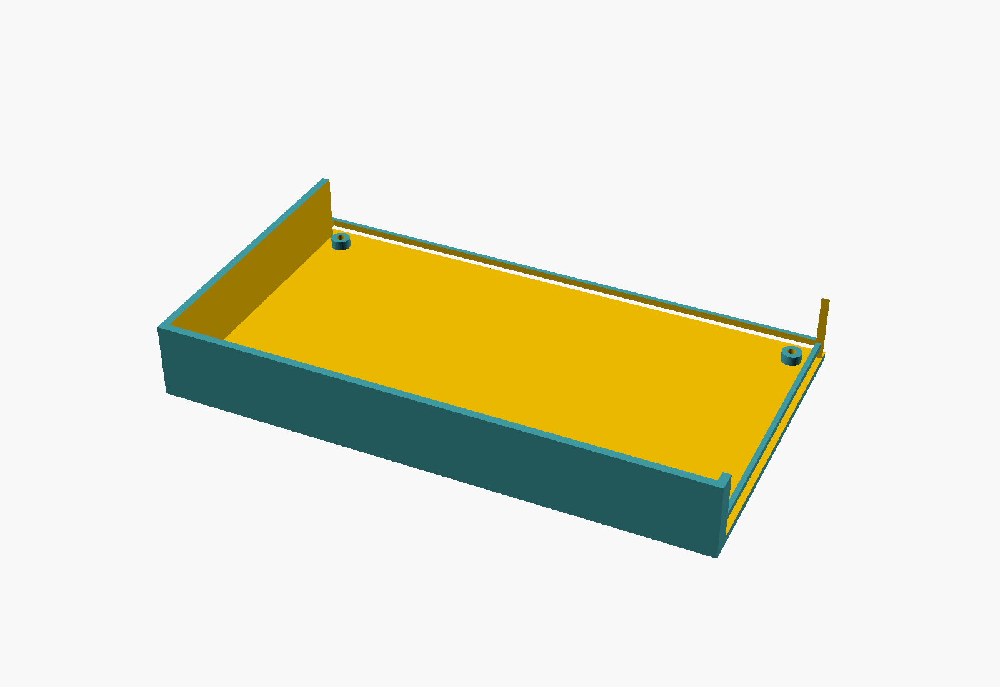

# QMTECH XC7K325T dev board -- 3D-printable case

An open-top protective tray for the [QMTECH XC7K325T dev board](../README.md),
sized from the board's own user manual (Figure 2-1: 160mm x 90mm outline).
Parametric OpenSCAD, FDM-print friendly (no supports needed).




## Files

- `qmtech_xc7k325t_case.scad` -- the parametric source. All dimensions are
  named variables at the top of the file.
- `qmtech_xc7k325t_case.stl` -- exported mesh, ready to slice.

## Design decisions (read before printing)

1. **Open top, on purpose.** The manual documents a CM4-class module
   plugging in near the top edge via a tall card-edge connector, plus 3
   pin headers, a DC barrel jack, a micro-USB port, and a switch cluster,
   all along that same edge -- none of their exact positions or the
   CM4+heatsink stack height are in the manual's dimensioned drawing.
   Rather than guess cutout heights that might not fit, that entire edge
   (Y=0 in the model) is left fully open -- no wall there at all, not
   just a window. This also covers the long pin header visible along the
   board's other long edge in the manual's dimension drawing: its pins
   point straight up, not sideways, so the open top already clears it.
2. **Cutout windows are modeled on one short edge only** -- the one the
   manual's cover photo shows hosting, top to bottom: HDMI, HDMI,
   microSD/TF, USB-A, USB-A, RJ45 Ethernet. Their positions are estimated
   **proportionally from that photo**, not measured, and each window is
   deliberately oversized (`cutout_margin` in the .scad) to absorb that
   uncertainty. If a window doesn't line up once you have the board,
   adjust `connector_positions_mm` and re-render.
3. **Corner standoffs are secondary, not load-bearing.** The board's
   primary retention is a perimeter lip it simply drops onto, which
   works regardless of where the real mounting holes are.
   `standoff_inset_mm` is a generic 5mm default, not transcribed from the
   manual's dimension drawing with confidence (its leader lines weren't
   legible enough to trust precisely). If the standoffs don't land on
   real holes, the lip alone still holds the board.
4. **Square corners, not rounded** -- not a style choice. An earlier
   `hull()`-of-circles rounded-corner version silently produced CGAL
   boolean geometry that the connector-cutout subtraction did not
   actually intersect (confirmed by A/B vertex-count testing: subtracting
   6 cutout windows changed the mesh by ~0 vertices with rounded corners,
   vs. +36 vertices with square ones). Square corners print at least as
   well on FDM (no overhang concerns either way) and don't have this bug.
5. **Print a fit-check first.** Given the estimates in points 2-3, print
   a quick low-infill version (or just the first ~5mm of height) before
   committing to a full detail print, and confirm the board drops into
   the lip cleanly and the connector windows land where they should.

## Print settings

Nothing unusual: 0.2mm layers, 15-20% infill, no supports (everything
overhangs at 90° from a flat base or less). PETG or ABS if the board runs
hot enough that PLA's ~55-60°C heat deflection becomes a concern near
the FPGA.

## Regenerating

```sh
openscad -o qmtech_xc7k325t_case.stl qmtech_xc7k325t_case.scad
```
Requires OpenSCAD 2021.01+ (uses `linear_extrude`/`difference` only, no
exotic features). No other dependencies.
