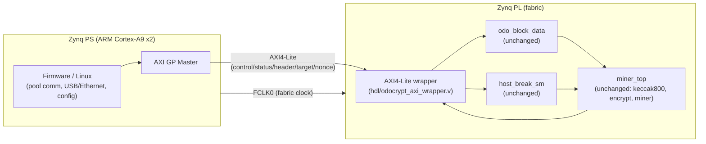

# AM01 + Zynq (FPGA+ARM) variant — design proposal

Status: **proposal / work in progress**, not a verified hardware revision.
This folder sketches what it would take to replace the AM01's
`Artix-7 XC7A200T + Cypress FX3` pair with a single **Xilinx Zynq-7000**
SoC that has ARM Cortex-A9 cores (the "PS", processing system) fused with
FPGA fabric (the "PL", programmable logic) on one die. It does **not**
change or replace the existing AM01 hardware documented in the repo root —
it lives alongside it as an alternate board concept.

## Why Zynq instead of a separate ARM chip

The current AM01 architecture is: `Cypress FX3 (USB3, does the host talk)`
`<-- DQ[31:0] bus / strobe_data / we / FX3_ready / artix_ready -->`
`Artix-7 XC7A200T (does the hashing)`. Two chips, one narrow parallel bus,
and a hand-rolled handshake protocol (`usb3_interface.v` / `usb3_sm_v3.v`)
to move data across it.

A Zynq collapses that into one chip: the ARM cores talk to the hashing
logic over an on-chip **AXI** interconnect instead of an external bus, so
the whole FX3 + DQ-bus handshake goes away. The ARM side can run
firmware or embedded Linux, do USB/Ethernet/host communication itself,
and load work into the hash core with ordinary memory-mapped writes.

## Related prior art

[colneech-dev/odo-miner-cyclonev](https://github.com/colneech-dev/odo-miner-cyclonev)
is a **deployed, hardware-verified** version of this same idea — HPS
(ARM Cortex-A9) fused with FPGA fabric on a Cyclone V SoC (Intel/Altera's
equivalent of Zynq), running the OdoCrypt pool client entirely on-chip,
mining on mainnet (485+ blocks). It isn't Xilinx/Zynq and isn't AM01's
odocrypt core, but it's the same architecture shape and the same class of
CDC/register-map problems this doc's wrapper has to solve, worked through
on real silicon. `docs/register-map.md` and `docs/uio-miner-io-scope.md`
there are worth reading before implementing the pieces sketched below.

## Chip selection

The existing `atomminer_odocrypt` example (see `exmaples/odocrypt/fpga/utilization.txt`)
uses, on the XC7A200T-1FBG484I:

| Resource | Used | Available on XC7A200T | Util% |
|---|---|---|---|
| Slice LUTs | 36,843 | 133,800 | 27.5% |
| Block RAM tiles (36Kb eq.) | 211 | 365 | 57.8% |
| DSP48 | 0 | 740 | 0% |

BRAM is the binding constraint (57.8%), not LUTs. That rules out the
smallest Zynq-7000 parts. Candidates:

| Part | ARM cores | LUTs | BRAM (36Kb tiles) | DSP48 | Notes |
|---|---|---|---|---|---|
| **XC7Z030** (Zynq-7030) | 2x Cortex-A9 @ 800MHz | ~78,600 | 265 | 400 | Fits today's single-instance odocrypt design (36.8K LUT / 211 tiles) with headroom for a second instance; cheapest part that clears the BRAM bar. |
| **XC7Z045** (Zynq-7045) | 2x Cortex-A9 @ 866MHz | ~218,600 | 545 | 900 | Matches/exceeds the full XC7A200T's fabric — pick this if production firmware instantiates several parallel hash engines (the odocrypt demo is a single instance, real miner loads are usually not). |
| Zynq UltraScale+ ZU3EG/ZU4EV | 4x Cortex-A53 + 2x Cortex-R5 | 154K–192K (system logic cells) | varies | varies | Newer family; some parts include native **USB 3.0** and PCIe/high-speed transceivers if you want to keep USB3-class host bandwidth. Pricier, different toolflow (Vitis/Vivado 2020+, PS is more complex to bring up). |

Recommendation: start with **XC7Z030** for a faithful 1:1 port of the
existing hash core, move to **XC7Z045** if/when the design grows to
multiple parallel engines. Both come in packages routable on a 4-6 layer
PCB comparable to AM01's current board.

Note this is **not a drop-in chip swap** — Zynq parts have entirely
different pinout/package/power-rail requirements (PS needs its own DDR3/DDR3L
memory, dedicated PS power rails, a boot flash/SD card, etc.). This is a new
board/schematic, not a BOM substitution on the existing AM01 PCB.

**Expected per-instance hashrate, cross-referenced not guessed:** `miner.v`
here is the upstream `THROUGHPUT 4` pipelined `odo_encrypt` core
(MentalCollatz) that odo-miner-cyclonev (above) benchmarked in Quartus on
comparable-class fabric at **Fmax = 162.1MHz**, and runs deployed at
156.25MHz on real hardware. The upstream reference point for this exact
core is **150MHz → 37.5MH/s per instance**. Xilinx 7-series -1 speed grade
should have at least as much headroom as that Cyclone V part, but that's
a cross-vendor estimate, not Vivado STA for a Zynq PL fabric — verify once
this is actually synthesized.

## Architecture

Everything below `odo_block_data` / `host_break_sm` / `miner_top` in
`hdl/odocrypt/` (`encrypt.v`, `keccak800.v`, `miner.v`, `atomminer_misc.v`
— a copy of `exmaples/odocrypt/fpga/src/hdl/` kept in sync with the
current OdoCrypt epoch, see `hdl/odocrypt/NOTICE`) is **untouched** — it
has no board-specific pins or IP dependencies and ports straight over.
What gets replaced is everything
that talked to the FX3 chip:

| Removed (FX3-era) | Replaced by |
|---|---|
| `usb3_interface.v`, `usb3_sm_v3.v` | `hdl/odocrypt_axi_wrapper.v` (AXI4-Lite slave) |
| `usb3_system_ram` IP (32x32 block RAM fed by the DQ bus state machine) | ordinary AXI-Lite register writes, no serialization needed |
| `DQ[31:0]` / `strobe_data` / `we` / `FX3_ready` / `artix_ready` / `FX3_comm` pins | on-chip AXI4-Lite bus (no top-level pins at all) |
| `artix200_v3_clocking` (MMCM off external 19.2MHz `gclk`) | PS-generated fabric clock (`FCLK0`), or keep an external oscillator + PL MMCM if you need to preserve the exact hash-core clock/jitter used today |
| `clk_pclk` (100MHz MMCM off external `pclk`) | PS AXI clock domain, or a second FCLK |
| Cypress FX3 chip + its firmware | PS peripherals: USB 2.0 OTG and/or Gigabit Ethernet MAC, both built into the Zynq PS |

One real trade-off: the Zynq-7000 PS's built-in USB controller is
**USB 2.0 High-Speed (480 Mbps)**, not USB3 like the FX3. For this
workload — loading a ~27-word header/target and polling a nonce — that's
far more bandwidth than needed, so it's not a practical bottleneck. If
USB3-class host bandwidth matters for other reasons, use Ethernet (also
free on the Zynq-7000 PS) or move to a Zynq UltraScale+ part with native
USB 3.0.

## Register interface (`hdl/odocrypt_axi_wrapper.v`)

> **Single source of truth.** Any change to the table below MUST be
> matched in `hdl/odocrypt_axi_wrapper.v` in the same commit.
> odo-miner-cyclonev's register-map doc calls this exact kind of drift
> **"the #1 bring-up failure mode"** for an HPS/PS-driven FPGA miner —
> take that as a warning from a project that actually hit it, not
> boilerplate.

The old protocol serialized 27 words (19 header + 8 target dwords) across
the DQ bus, sequenced by `usb3_sm_v3`'s hand-timed delay chains
(`delreg_varbits_vardel`, 6/7/10-cycle waits) because the FX3 link only
had one narrow bus. None of that is needed once the "host" is an ARM core
doing native 32-bit AXI writes — it can just write the words directly.
The wrapper collapses the protocol to:

| Offset | Name | Access | Meaning |
|---|---|---|---|
| `0x00` | `VERSION` | RO | Build/version tag |
| `0x04` | `CTRL` | WO (pulse bits) | bit0 `SOFT_RST` (resets word counters / `start_hash`), bit1 `HOST_BREAK` (→ `host_break_sm`); reads back as 0 |
| `0x08` | `STATUS` | RO | bit0 `HASH_ACTIVE` (mirrors `start_hash`), bit1 `NONCE_VALID` |
| `0x0C` | `GOLDEN_NONCE` | RO | Latched nonce once `ticket2moon` fires; **reading this register clears `NONCE_VALID` and deasserts `irq`** |
| `0x10` | `HEADER_FIFO` | WO | Write 19 times in order to shift in the 608-bit header (feeds `odo_block_data`'s existing `get_block_in` shift chain) |
| `0x14` | `TARGET_FIFO` | WO | Write 8 times in order to shift in the 256-bit target (feeds `get_target_in`); the 8th write arms `start_hash` |

Firmware flow: write 19 header words → write 8 target words → poll
`STATUS.NONCE_VALID` or wait for `irq` → read `GOLDEN_NONCE` (this also
clears the interrupt). `odo_block_data`, `host_break_sm`, and `miner_top`
are instantiated completely unmodified from `hdl/odocrypt/` (see
`hdl/odocrypt/NOTICE`).

Every `HEADER_FIFO`/`TARGET_FIFO`/`CTRL` write crosses from the AXI clock
domain into the hash-core clock domain over a toggle/ack handshake (see
below), and the AXI write response (`BVALID`) is held off until that
handshake completes — so back-to-back writes are automatically paced by
the hardware and firmware doesn't need to poll a separate "busy" bit.

## What's still needed before this is real hardware

This is an RTL skeleton to design against, not verified/synthesized
silicon-ready code. Before treating it as production:

1. **Clock-domain crossing**: `s_axi_aclk` (PS/AXI side) and `clk_h`
   (hash core side) are two different clocks. The wrapper uses simple
   2-flop synchronizers for the control/status bits and the FIFO pulses;
   for a real tape-out this should go through a verified CDC primitive
   (e.g. Vivado's AXI Clock Converter IP on the bus, plus a properly
   constrained handshake for the header/target load pulses) and pass
   CDC-aware timing analysis.
2. **Block design**: this file is meant to sit in a Vivado IP Integrator
   block design as a custom AXI4-Lite peripheral hung off the Zynq PS's
   `M_AXI_GP0`, alongside the standard Processor System Reset and Zynq PS
   IP blocks. That block design isn't included here.
3. **New schematic + pinout**: DDR memory for the PS, PS power rails, boot
   source (QSPI/SD), and a full pin/package plan for the chosen Zynq part
   — none of this reuses AM01's existing schematic or `am01_pinout.xdc`.
4. **Firmware**: something has to run on the ARM cores (bare-metal or
   embedded Linux) to drive the register interface and do host
   communication — not included here.
5. **Nonce delivery is a single-register latch, not a FIFO** — `GOLDEN_NONCE`
   holds only the most recent find; if two land back-to-back faster than
   firmware drains it, the earlier one is silently overwritten (see the
   wrapper's `golden_nonce_axi`/`nonce_valid_axi`). Real gap, not
   theoretical: odo-miner-cyclonev hit this and fixed it with a **depth-8
   dual-clock async FIFO (Gray-code pointers) + a sticky overflow bit** —
   see their `docs/register-map.md` §4 for the exact pattern.
6. **Toolchain**: this doc assumes Vivado (needed regardless for the PS
   configuration/boot files a real Zynq bring-up requires — FSBL, boot.bin,
   the PS7/PS8 IP wizard). **[openXC7](https://github.com/openXC7)** (a
   free Yosys + nextpnr-xilinx flow) lists Zynq-7 among its supported
   families, but that most likely covers PL-fabric synthesis only, not
   Zynq's PS bring-up — not evaluated here, and probably a much smaller
   win for this variant than for the plain-FPGA `hardware/qmtech-kintex7/`
   one.
